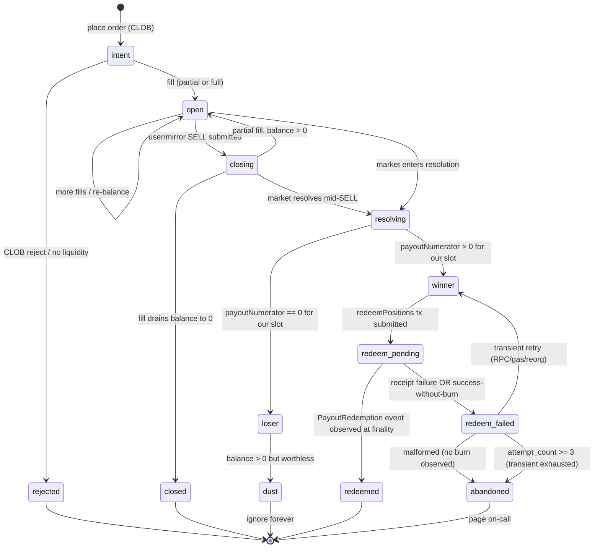
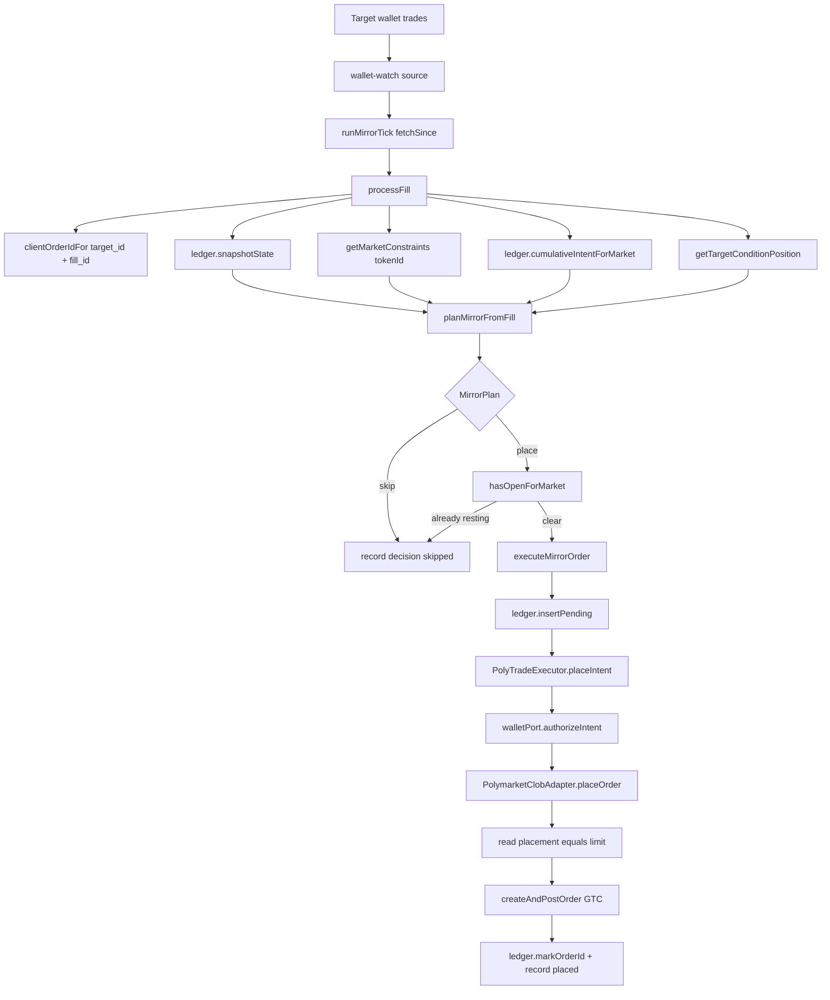
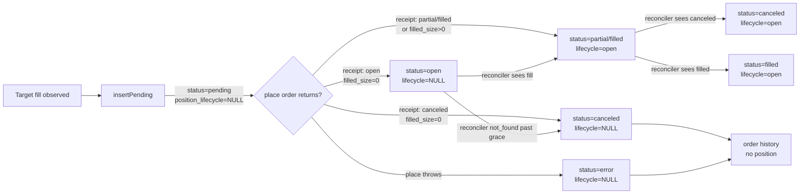
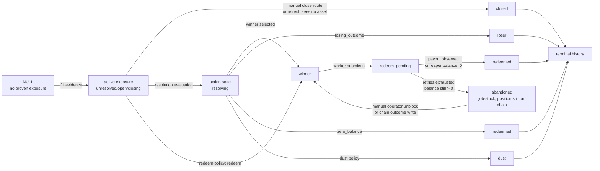
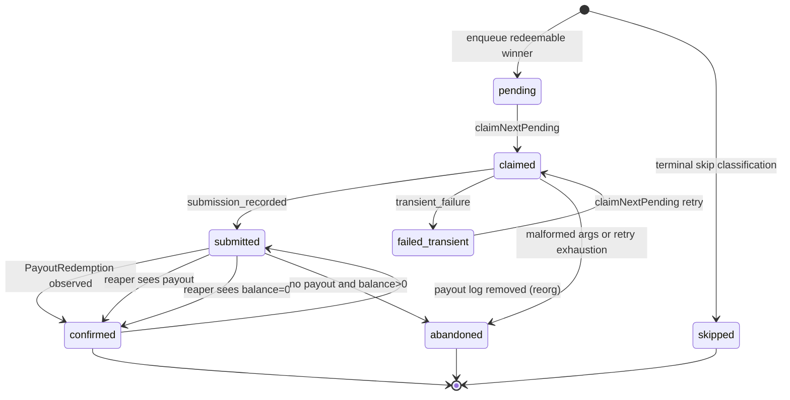
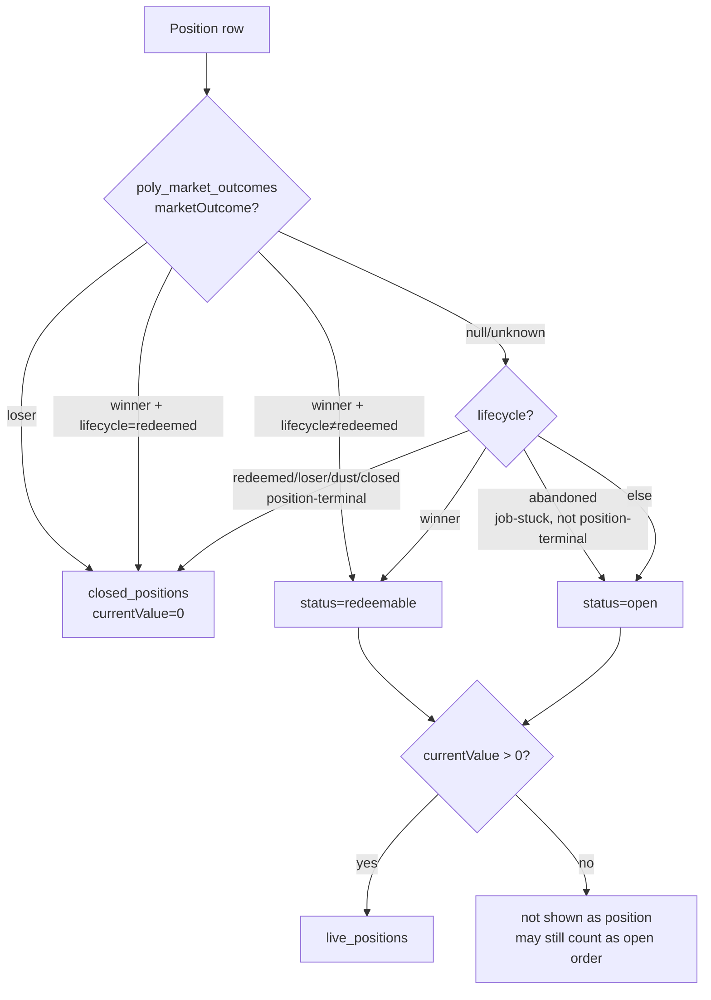

# Poly Copy-Trade Execution & Position Lifecycle

This spec is the single contract for the copy-trade placement pipeline, position lifecycle, redeem flow, and dashboard classification. Tenant authorization, per-tenant wallet provisioning, grants/caps, and the USDC.e ↔ pUSD collateral ceremony live in [`poly-tenant-and-collateral.md`](./poly-tenant-and-collateral.md).

## Goal

Mirror fills observed on a tracked target wallet onto a Cogni-controlled trading wallet, at-most-once, with bounded skip-reason cardinality and chain-grounded position state. The pipeline must:

- Decompose into three orthogonal layers so the policy boundary (`planMirrorFromFill`) stays pure.
- Preserve idempotency across crashes, retries, reorgs, and target re-fills via a deterministic `client_order_id`.
- Treat chain + CLOB as write authorities and Data-API + local DB as read caches/signals.
- Surface every decision (placed, skipped, errored) to the decisions ledger for divergence analysis.
- Render dashboard position state from chain authority, not from Data-API hints, with bounded fan-out per dashboard read.

## Non-Goals

- Polymarket's external CLOB internals beyond the statuses we store.
- Market-resolution policy internals (lives in `nodes/poly/packages/market-provider/src/policy/redeem.ts`).
- Portfolio PnL math, historical valuation, or research views (lives in `wallet-analysis/`).
- Tenant authorization model, grants/caps, or wallet provisioning — see `poly-tenant-and-collateral.md`.

## Design

Sections below define the as-built pipeline: layer decomposition, the four-authority position model and seven-state lifecycle, three independent state machines (order / position / redeem-job), the mirror-position cache view consumed by the pure planner, the redeem pipeline anchored on chain authority via `poly_market_outcomes`, user close + redeem flows, and the dashboard classification model. Schema constraints + implementation pointers follow the design narrative; load-bearing rules are captured under `## Invariants`.

## Layers

Three sibling slices under `nodes/poly/app/src/features/`. Each owns its vocabulary; only `copy-trade/` may import from both `trading/` and `wallet-watch/`.

```
┌─────────────────────────────────────────────────────────────────────┐
│  features/copy-trade/           (thin — policy + glue)              │
│    plan-mirror.ts    ← pure `planMirrorFromFill()` policy           │
│    mirror-pipeline.ts ← per-fill loop: snapshot → plan → place       │
│    types.ts          ← TargetConfig / RuntimeState / reasons         │
│    target-source.ts  ← cross-tenant target enumerator (RLS-aware)    │
└─────────────────────────────────────────────────────────────────────┘
         │                                                │
         ▼                                                ▼
┌──────────────────────────────┐      ┌──────────────────────────────┐
│  features/wallet-watch/      │      │  features/trading/           │
│    polymarket-source.ts      │      │    clob-executor.ts          │
│     ← Data-API /trades       │      │     ← wraps placeOrder fn    │
│    activity-poll.ts          │      │    order-ledger.ts           │
│     ← pure (source, since)   │      │     ← insertPending/mark*    │
│       → Fill[]               │      │    order-ledger.types.ts     │
└──────────────────────────────┘      └──────────────────────────────┘
                                              │
                                              ▼
                                  packages/market-provider/
                                    PolymarketClobAdapter
                                    @polymarket/clob-client
```

### Layer responsibilities

| Layer                    | Vocabulary                            | Inputs                                       | Outputs                                            |
| ------------------------ | ------------------------------------- | -------------------------------------------- | -------------------------------------------------- |
| `features/trading/`      | order, intent, receipt, ledger        | `OrderIntent`, CLOB receipts                 | `LedgerRow` transitions, snapshots                 |
| `features/wallet-watch/` | trade, fill, cursor                   | tracked-wallet address, since-cursor         | `Fill[]`                                           |
| `features/copy-trade/`   | target, mirror, fill, position-branch | `Fill`, `MirrorTargetConfig`, `RuntimeState` | `MirrorPlan` (place \| skip), decisions ledger row |

### Two runtime consumers

1. **Autonomous 30s mirror poll** (`nodes/poly/app/src/bootstrap/jobs/copy-trade-mirror.job.ts`). Consumes all three layers. The mirror-pipeline tick is `runMirrorTick(deps)`.
2. **Agent-callable tool** (`core__poly_place_trade` — `packages/ai-tools/src/tools/poly-place-trade.ts`). Consumes `trading/` only. Default placement = `market_fok` to preserve legacy semantics.

The mirror-pipeline is the **only** file that imports from both `wallet-watch` and `trading`. The Phase-4 WebSocket fill ingester (task.0322) will replace `wallet-watch` as the fill source without touching `trading` or `plan-mirror`.

## Position model

A position has **one identity, four authorities, seven lifecycle states**. The pipeline conflates these only at named seams; mixing authorities outside those seams is the root class of bugs 0376, 0383, 0384, 5040.

### Four identities — the same position

| Identity                              | Where it lives                       | Stability                      |
| ------------------------------------- | ------------------------------------ | ------------------------------ |
| `(wallet, conditionId, outcomeIndex)` | Domain key — what the user thinks of | Forever                        |
| `tokenId` (ERC-1155 id, decimal)      | Polymarket Data API `position.asset` | Forever                        |
| `positionId` (ERC-1155 id, BigInt)    | CTF contract balance lookup          | Forever (same number, base 10) |
| `(funderAddress, positionId)` slot    | Polygon CTF `balanceOf(addr, id)`    | The actual on-chain truth      |

### Four authorities — ordered

| #   | Authority                                                               | Latency            | Decides                                                               |
| --- | ----------------------------------------------------------------------- | ------------------ | --------------------------------------------------------------------- |
| 1   | **Polygon chain** (CTF + ERC-1155 + ERC-20)                             | seconds (finality) | Balance, payout numerators, redemption, allowance                     |
| 2   | **Polymarket CLOB write path**                                          | seconds            | Order acceptance, fills                                               |
| 3   | **Polymarket Data API** (`/positions`, `/balance-allowance`, `/trades`) | 5–60s lag          | Discovery, UI hints. **Never** authority for a write decision         |
| 4   | **Local DB** (`poly_*` tables)                                          | as-of-last-write   | App-owned write intent + cached read. Never authority for chain truth |

**Hard rule**: every write decision (place, cancel, close, redeem) consults #1 or #2 only. #3 is a discovery hint; #4 is a cache.

### Seven lifecycle states



**Authority per state entry**

| State            | Means                                                                                    | Authority for _entry_                                       |
| ---------------- | ---------------------------------------------------------------------------------------- | ----------------------------------------------------------- |
| `intent`         | Submitted a CLOB order; no fill yet                                                      | #2 CLOB write ack                                           |
| `open`           | Wallet has > 0 ERC-1155 balance                                                          | #1 chain `balanceOf` (Data API used for _enumeration only_) |
| `closing`        | A SELL is in flight against an open position                                             | #2 CLOB write ack                                           |
| `closed`         | Open → Closing → balance reaches 0 via SELL                                              | #1 chain `balanceOf == 0` after fill                        |
| `rejected`       | CLOB refused the order                                                                   | #2 CLOB error response                                      |
| `resolving`      | Market entered resolution (UMA / admin)                                                  | #1 CTF `ConditionResolution` event                          |
| `winner`         | Resolved AND `payoutNumerator(condId, ourIdx) > 0`                                       | #1 CTF `payoutNumerators`                                   |
| `loser`          | Resolved AND `payoutNumerator(condId, ourIdx) == 0`                                      | #1 CTF `payoutNumerators`                                   |
| `dust`           | Loser with non-zero ERC-1155 balance                                                     | #1 chain (terminal — never write against this)              |
| `redeem_pending` | `redeemPositions` tx submitted, awaiting receipt                                         | #2 chain submit ack + local job row                         |
| `redeemed`       | `PayoutRedemption(redeemer=funder, ...)` observed                                        | #1 chain event                                              |
| `redeem_failed`  | Receipt status=success, no `PayoutRedemption` from our funder, OR receipt status=failure | #1 chain event absence + receipt status                     |
| `abandoned`      | Three transient retries exhausted, OR malformed decision                                 | Local DB attempt counter — page a human                     |

## Three state machines

Three independent state axes; one stored per DB column. Canonical types in `nodes/poly/app/src/features/trading/order-ledger.types.ts`.

| Axis       | DB field                                      | Meaning                             | Authority                                    |
| ---------- | --------------------------------------------- | ----------------------------------- | -------------------------------------------- |
| Order      | `poly_copy_trade_fills.status`                | CLOB order row state                | CLOB receipt + reconciler                    |
| Position   | `poly_copy_trade_fills.position_lifecycle`    | Asset-scoped exposure for one token | Ledger writers, close/refresh, redeem mirror |
| Redeem job | `poly_redeem_jobs.status` + `lifecycle_state` | Redeem-tx job state                 | Redeem worker + subscriber + reaper          |

### 1. Mirror Decision → Limit Order

Order-entry path before the CLOB row joins the lifecycle below. Split into observation, pure planning, ledger-first execution, authorization, CLOB placement.



Review boundaries:

- `wallet-watch` only observes and emits normalized fills. It must not decide, write ledger rows, or place orders.
- `planMirrorFromFill` is pure. It receives target config, runtime snapshot, market constraints, and target-position context as input.
- `ledger.insertPending` runs **before** `placeIntent`. This is the at-most-once gate.
- `authorizeIntent` is downstream of planning and upstream of signing. Grant caps + revocation live there ([`poly-tenant-and-collateral.md`](./poly-tenant-and-collateral.md) §authorizeIntent), not in the planner.
- CLOB placement reads `OrderIntent.attributes.placement`; mirror orders default to `mirror_limit` → GTC `createAndPostOrder`.

### 2. CLOB Order Row



### 3. Position Lifecycle



### 4. Redeem Job



### 5. Dashboard Classification

Chain authority first; redeem-job lifecycle second. `abandoned` falls through — the worker giving up does NOT close the position.



## Order status (`LedgerStatus`)

| Status     | Meaning                                                  | Active order? | Position exposure?                                                                                 |
| ---------- | -------------------------------------------------------- | ------------- | -------------------------------------------------------------------------------------------------- |
| `pending`  | Ledger row inserted before placement returns             | Yes           | No, unless filled evidence later appears                                                           |
| `open`     | CLOB accepted a resting order                            | Yes           | Only if `filled_size_usdc > 0`                                                                     |
| `partial`  | CLOB order has filled shares and may have remaining size | Yes           | Yes                                                                                                |
| `filled`   | CLOB order fully filled                                  | No            | Yes                                                                                                |
| `canceled` | CLOB order canceled or promoted from stale `not_found`   | No            | Yes only when filled evidence exists                                                               |
| `error`    | Placement failed at the boundary                         | No            | No unless explicit filled evidence/lifecycle exists. Market-FOK errors still count intent for caps |

Order writers (in `nodes/poly/app/src/features/trading/order-ledger.ts`):

| Writer          | Transition                                                                                                                        |
| --------------- | --------------------------------------------------------------------------------------------------------------------------------- |
| `insertPending` | New row starts `status='pending'`, `position_lifecycle=NULL`                                                                      |
| `markOrderId`   | Maps placement receipt to `open`, `partial`, `filled`, or `canceled`; promotes lifecycle to `open` when receipt has fill evidence |
| `updateStatus`  | Reconciler updates status + `filled_size_usdc`; promotes lifecycle to `open` when fill evidence appears                           |
| `markCanceled`  | User/system cancel; does not clear position exposure                                                                              |
| `markError`     | Placement-boundary error; does not claim exposure                                                                                 |

## Position lifecycle (`LedgerPositionLifecycle`)

| Lifecycle        | Class              | Meaning                                                                                                                            | Active resting slot?                                     |
| ---------------- | ------------------ | ---------------------------------------------------------------------------------------------------------------------------------- | -------------------------------------------------------- |
| `NULL`           | no proven position | No typed exposure yet                                                                                                              | Yes when order status is `pending`, `open`, or `partial` |
| `unresolved`     | active             | Position exists; market resolution not known                                                                                       | Yes                                                      |
| `open`           | active             | Position exists and is not closing/resolving/redeemed                                                                              | Yes                                                      |
| `closing`        | active             | Close is in progress                                                                                                               | Yes                                                      |
| `closed`         | terminal           | Wallet no longer holds this asset after sell/refresh                                                                               | No                                                       |
| `resolving`      | action             | Market resolution being evaluated                                                                                                  | No                                                       |
| `winner`         | action             | Asset is a winning/redeemable outcome                                                                                              | No                                                       |
| `redeem_pending` | action             | Redeem transaction submitted or reorg-reset to submitted                                                                           | No                                                       |
| `redeemed`       | terminal           | Redeem completed or chain proves no remaining balance                                                                              | No                                                       |
| `loser`          | terminal           | Losing outcome                                                                                                                     | No                                                       |
| `dust`           | terminal           | Loser with non-zero balance (reserved; current policy does not emit)                                                               | No                                                       |
| `abandoned`      | stuck (job-only)   | Redeem WORKER exhausted retries; shares may still be on chain. **NOT a position-terminal state** — dashboard reads chain authority | No                                                       |

Predicates live in `nodes/poly/app/src/features/trading/ledger-lifecycle.ts`.

Terminal lifecycles are `closed`, `redeemed`, `loser`, `dust`. Terminal rows are position history and must not be reopened by stale CLOB refresh. The SQL adapter enforces this via `preserveTerminalLifecycle()` in `order-ledger.ts`. The only allowed terminal correction is a chain reorg: `redeemed → redeem_pending` when the redeem subscriber observes a removed `PayoutRedemption` log, marked explicitly with `terminal_correction='redeem_reorg'`.

## Required Matrix

Fast review matrix for order + position state. Reviewers should check every change against this table.

| Order status | `position_lifecycle`      | Meaning                                          | Dashboard / action behavior                  |
| ------------ | ------------------------- | ------------------------------------------------ | -------------------------------------------- |
| `pending`    | `NULL`                    | Insert-before-place row, no receipt yet          | Active order/resting; no position value      |
| `open`       | `NULL`                    | Resting order with no fill evidence              | Active order/resting; no position value      |
| `open`       | `open`                    | Resting order with partial fill evidence         | Live position + remaining order              |
| `partial`    | `open`                    | Partial fill                                     | Live position; may still rest                |
| `filled`     | `open`                    | Fully filled position                            | Live position                                |
| `canceled`   | `NULL`                    | No-fill canceled order                           | Inert history; no position                   |
| `canceled`   | `open` or action/terminal | Filled before cancel or later lifecycle evidence | Preserve and display according to lifecycle  |
| `error`      | `NULL`                    | Failed placement with no exposure proof          | Inert; market-FOK may still count cap intent |
| `error`      | `open` or action/terminal | Failed boundary but exposure later proven        | Preserve and display according to lifecycle  |
| any          | terminal lifecycle        | Historical asset row                             | Not active/resting; current value = 0        |
| any          | `winner`                  | Redeemable asset                                 | Actionable redeem row                        |
| any          | `redeem_pending`          | Redeem in flight                                 | Action disabled or pending                   |

## Mirror position cache view (`MirrorPositionView`)

Synchronous cache derived from `poly_copy_trade_fills` at snapshot time; consumed by `planMirrorFromFill` so it can branch on "do we already hold this side?" without breaking `PLAN_IS_PURE`.

### Authority bounds

| Concern                                               | Authority used                                       | Type                             |
| ----------------------------------------------------- | ---------------------------------------------------- | -------------------------------- |
| Mirror policy hint (already-mirrored? which side?)    | #4 Local DB cache                                    | `MirrorPositionView`             |
| Settlement / redeem                                   | #1 Polygon chain via `poly_redeem_jobs` flow         | `OperatorPosition` + chain reads |
| SELL routing pre-check (do we have balance to close?) | #3 Data API via `getOperatorPositions`, then #2 CLOB | `OperatorPosition`               |

**Hard rule**: `MirrorPositionView` may inform _what to plan_ (skip / hedge / layer / route to closePosition). It must **never** be used to decide _whether the wallet actually holds the shares_ — that path stays as today via `getOperatorPositions` (#3 → #1).

### Shape

```ts
export const MirrorPositionViewSchema = z.object({
  condition_id: z.string(),
  /** Token id with our larger net long exposure. Undefined ⇒ no exposure either side. */
  our_token_id: z.string().optional(),
  /** Net shares on `our_token_id` (intent-based). */
  our_qty_shares: z.number(),
  /** Sum-USDC-in / sum-shares-in for `our_token_id`. Undefined when our_qty_shares == 0. */
  our_vwap_usdc: z.number().optional(),
  /**
   * Complementary token in this binary market, if known. Undefined for:
   *   (a) markets we've only traded one side of and market-meta is unavailable
   *   (b) multi-outcome / neg-risk markets where binary "opposite" doesn't apply
   * Hedge-followup predicate must NO-OP when this is undefined.
   */
  opposite_token_id: z.string().optional(),
  /** Net shares on `opposite_token_id`. Zero unless we've hedged. */
  opposite_qty_shares: z.number(),
});
```

### Filled vs intent — explicit choice

The schema does not carry a `filled_size_usdc` column distinct from intent. We treat **intent shares as the position quantity for mirror-policy purposes**: a resting `open` order is treated as fully exposed for follow-on sizing math. This is intentionally fail-safe upward — hedge-followup and same-side layering under-shoot rather than over-shoot. Settlement truth (e.g. "can I actually close this?") still consults `getOperatorPositions` (#3 → #1).

### Storage decision

Derived in SQL inside `OrderLedger.snapshotState` (no new table, no migration, no triggers). One extra `GROUP BY` per fill on a `target_id`-indexed table. Fail-closed: DB error → `position_aggregates: []`, planner sees no prior exposure.

### Within-tick freshness

`snapshotState` runs per-fill, not once per tick. Combined with `INSERT_BEFORE_PLACE`, the next fill's `snapshotState` reads a DB that already contains the prior fill's pending row. The position SQL filter includes `pending` rows alongside `open | filled | partial`. No in-memory mutation logic required.

### Plumbing

```ts
export const RuntimeStateSchema = z.object({
  already_placed_ids: z.array(z.string()),
  cumulative_intent_usdc_for_market: z.number().optional(),
  /** Mirror position cache view for this fill's condition_id. Undefined ⇒ no prior exposure. */
  position: MirrorPositionViewSchema.optional(),
  /** Target-wallet position on the same condition (v0: Data-API; vNext: persisted target activity). */
  target_position: TargetConditionPositionViewSchema.optional(),
});
```

`mirror-pipeline.ts:processFill` calls `aggregatePositionRows(snapshot.position_aggregates)` and picks `.get(fill.market_id)` into `state.position`. No I/O added to the planner.

### Branch decision — target-dominance drives routing (bug.5048)

Branch detection is computed from target's per-condition cost fractions first, then routed by our position state. Our position is downstream; it may be empty, undersized, or on the wrong side from cross-target activity.

**Dominance signal** (computed per fill via `analyzeTargetDominance` in `plan-mirror.ts`):

- `side_fraction[token_id] = cost_usdc[token_id] / Σ cost_usdc` over `state.target_position.tokens`.
- "**Minority**" = `side_fraction[fill.tokenId] < config.min_target_side_fraction`. Single-threshold model.
- "**Dominant**" = `arg max(cost_usdc)` over `state.target_position.tokens`. Not minority.
- Disabled (gate inactive, fall back to legacy our-position routing) when `min_target_side_fraction` is undefined, target_position is unavailable, or total cost is 0.

**Branch table:**

| target side of fill                                                               | our position state                                  | branch                                      | action                                                                                                                                                                             |
| --------------------------------------------------------------------------------- | --------------------------------------------------- | ------------------------------------------- | ---------------------------------------------------------------------------------------------------------------------------------------------------------------------------------- |
| **minority** (below `min_target_side_fraction`)                                   | **any**                                             | skip `target_dominant_other_side`           | **Master switch.** Below-threshold sides are below the configured conviction; we never mirror as entry, layer, OR hedge. Catches Chelsea/Nott-Forest regardless of position state. |
| above threshold + matches target's dominant tokenId                               | no mirror                                           | `new_entry_dominant`                        | `applySizingPolicy` (percentile/scaled sizing)                                                                                                                                     |
| above threshold + matches target's dominant tokenId                               | mirror on dominant                                  | `layer_dominant`                            | `sizeLayerDominant` (inherits `position_followup` layer gates)                                                                                                                     |
| above threshold + matches target's dominant tokenId                               | mirror on minority (cross-target)                   | `new_entry_dominant` + `wrong_side_holding` | open dominant-side parallel leg; emit `poly_mirror_wrong_side_holding_total` + WARN                                                                                                |
| above threshold + NOT target's dominant (multi-outcome non-edge, balanced binary) | mirror on opposite of fill (binary, opposite known) | `hedge`                                     | `sizeHedge` (inherits hedge ratio + min_usdc + max_fraction gates) — fires when target's opposite-side cost is above threshold AND we hold their primary                           |
| above threshold + NOT target's dominant                                           | other (no opposite known, or mirror matches fill)   | falls to legacy our-position routing        | layer if `our_token_id` matches fill; else new_entry                                                                                                                               |

**Hedge mirroring scope (v1):** hedges fire only when target's opposite-side cost exceeds `min_target_side_fraction` (i.e. is itself a meaningful position, e.g. 70/30 splits). On heavily asymmetric targets (95/5 like Chelsea) the 5% side stays gated as minority — we do not chase tiny hedge scalps as alpha. More permissive hedge mirroring is a v2 follow-up.

**VWAP gate** (after branch selection, before sizing finalization):

- `target_vwap[token] = Σ cost_usdc / Σ size_shares` over rows matching `fill.tokenId` in `target_position.tokens`.
- If `fill.price > target_vwap + config.vwap_tolerance`, skip with `vwap_floor_breach`. Asymmetric — only the upward bound is gated.
- Fail-open when target VWAP is unknown (no target_position, no matching token, or zero shares).

### Skip-reason precedence (decision ordering)

The first matching predicate wins:

1. `already_placed` — idempotency.
2. `market_past_end_date` — liveness.
3. `price_outside_clob_bounds` — tick-grid normalization.
4. **`target_dominant_other_side`** — dominance gate.
5. **`vwap_floor_breach`** — VWAP gate (only on place-bound branches).
6. Sizing skips: `below_target_percentile` / `below_market_min` / `position_cap_reached` / `target_position_below_threshold` / `followup_position_too_small` / `followup_not_needed`.
7. `already_resting` — pipeline-level dedup (post-plan, pre-insert).

## Redeem pipeline

Two capabilities + one subscription. The cooldown-Map / sweep-mutex from the v0 prototype is dead.

### Capability A — Pure redeem policy

In `nodes/poly/packages/market-provider/src/policy/redeem.ts`.

- Inputs: chain reads (`balance`, `payoutNumerator`, `payoutDenominator`), `negativeRisk` flag, our `outcomeIndex`, market's outcome cardinality.
- Output: discriminated decision — `redeem(indexSet, expectedShares, expectedPayoutUsdc) | skip(reason) | malformed(reason)`.
- No I/O; judges chain reads passed in.

### Capability B — Redeem job queue

Persistent, idempotent state machine for the `winner → redeem_pending → redeemed | redeem_failed | abandoned` slice.

- Backing store: `poly_redeem_jobs` table. Unique key on `(funder_address, condition_id)` — duplicate enqueue is a no-op.
- Producer: chain-event subscriber + manual user redeem button.
- Consumer: one worker per process draining `WHERE status = 'pending' FOR UPDATE SKIP LOCKED`.
- Cooldown is a SQL `WHERE` clause, not a Map. Multi-pod-safe by construction.
- Transitions (see Redeem Job FSM above) — submission → confirmed requires observed `PayoutRedemption` from our funder at **N-block finality** (N=5 post-Heimdall-v2, hard-pinned).
- `REDEEM_RETRY_IS_TRANSIENT_ONLY` — only RPC/gas/reorg failures retry. Malformed (success + no funder burn) → `abandoned` immediately.

### Subscription — chain events drive everything

Subscribe to **both** the CTF contract and the neg-risk adapter contract:

- **CTF `ConditionResolution(conditionId, oracle, questionId, outcomeSlotCount, payoutNumerators[])`** → for each of our funder's positions in that condition, evaluate Capability A. If `redeem`, INSERT into `poly_redeem_jobs`. **Same handler also UPSERTs `poly_market_outcomes`** — see "Chain-resolution authority" below.
- **CTF `PayoutRedemption(redeemer, collateralToken, parentCollectionId, conditionId, indexSets[], payout)`** → if `redeemer == funder` AND a job exists for `(funder, conditionId)`, mark `confirmed` after N-block finality.
- **NegRiskAdapter `PayoutRedemption(address indexed redeemer, bytes32 indexed conditionId, uint256[] amounts, uint256 payout)`** at `0xd91E80cF2E7be2e162c6513ceD06f1dD0dA35296` → same `redeemer == funder` matching rule. Different topic hash from CTF's `PayoutRedemption` because of the parameter shape difference; both must be subscribed.

A reorg observed within N blocks reverts `confirmed → submitted`; the worker re-checks at next finality. This is what `REDEEM_COMPLETION_IS_EVENT_OBSERVED` means in practice.

**Catch-up backstop.** Startup + daily cron tick scans historical events from `last_processed_block` to `head` and replays through Capability A. This is the **only** legitimate sweep in the system; it is bounded by chain history, not by a periodic Data-API predicate.

### Chain-resolution authority — `poly_market_outcomes`

The single source of truth for "is this market resolved, and which token won?" lives in `poly_market_outcomes` (PK `(condition_id, token_id)`; columns `outcome IN ('winner','loser','unknown')`, `payout`, `resolved_at`, `raw`, `updated_at`). Schema in `nodes/poly/packages/db-schema/src/trader-activity.ts`.

Write path: `redeem-subscriber.handleConditionResolution` UPSERTs one row per `(condition_id, token_id)` on every `ConditionResolution` chain event (live + catchup replay). One DB UPSERT per chain event (not per funder). UPSERT shape:

```sql
INSERT INTO poly_market_outcomes (condition_id, token_id, outcome, payout, resolved_at, raw, updated_at)
VALUES (...)
ON CONFLICT (condition_id, token_id) DO UPDATE SET
  outcome    = EXCLUDED.outcome,
  payout     = EXCLUDED.payout,
  resolved_at= EXCLUDED.resolved_at,
  raw        = EXCLUDED.raw,
  updated_at = now();
```

Idempotent: re-receiving the same chain log produces the same result.

Read path: dashboard execution route LEFT-JOINs `poly_market_outcomes` on `(condition_id, token_id)` and derives the `redeemable`/`closed` classification purely from DB. **Zero Data-API or RPC calls on the dashboard read path.**

`raw.redeemable` from the Polymarket Data API is **dead in this codebase** — `redeemable=true` means "market resolved AND you held shares at snapshot time," _not_ "you have a winner." Loser shares are technically `redeemable` for $0 in CTF terms (`payoutNumerator=0`).

### Redeem lifecycle mirroring

| Redeem event                | Job status              | Ledger position lifecycle                      | Writer                                                  |
| --------------------------- | ----------------------- | ---------------------------------------------- | ------------------------------------------------------- |
| Policy says redeemable      | enqueue `pending` job   | `winner`                                       | `decision-to-enqueue-input.ts`, redeem route/subscriber |
| Worker submits tx           | `claimed → submitted`   | `redeem_pending`                               | `redeem-worker.ts`                                      |
| Payout observed             | `submitted → confirmed` | `redeemed`                                     | `redeem-subscriber.ts`, `redeem-catchup.ts`             |
| Reaper proves redeemed      | `submitted → confirmed` | `redeemed`                                     | `redeem-worker.ts`                                      |
| Reorg removes payout        | `confirmed → submitted` | `redeem_pending`                               | `redeem-subscriber.ts`                                  |
| Malformed / retry exhausted | `→ abandoned`           | `abandoned` (job-stuck, not position-terminal) | `redeem-worker.ts`, manual route poll                   |
| Losing outcome              | enqueue `skipped` job   | `loser`                                        | `decision-to-enqueue-input.ts`                          |
| Zero balance                | enqueue `skipped` job   | `redeemed`                                     | `decision-to-enqueue-input.ts`                          |
| Unresolved / read failed    | no job row              | no ledger mirror                               | `decision-to-enqueue-input.ts`                          |

**Asset-scoped writes.** Redeem mirror code must call `markPositionLifecycleByAsset(...)`, not condition-wide mutation, because one condition has multiple outcome assets. CTF `positionId` is persisted as `poly_redeem_jobs.position_id` and mirrored into `poly_copy_trade_fills.attributes.token_id`. `markPositionLifecycleByConditionId(...)` is reserved for true condition-level resolution replay where the lifecycle applies to every matching row.

### Abandoned runbook

`abandoned` has **two distinct alert classes** that share the `poly.ctf.redeem.abandoned` Loki channel; the payload carries a `class` field. Do not collapse them.

**Class A — `malformed` (Capability A blind spot)**: decision was structurally wrong (wrong index set, wrong parent collection, binary path on a neg-risk position). Code defect. Fix Capability A, add fixture, re-enqueue:

```sql
UPDATE poly_redeem_jobs
SET status='pending', attempt_count=0,
    tx_hashes = tx_hashes || ARRAY[last_tx_hash],
    last_error=NULL, updated_at=now()
WHERE (funder_address, condition_id) = (...);
```

**Class B — `transient_exhausted` (infrastructure)**: three transient retries (RPC timeout, gas underpriced, reorg-during-submit) failed in a row. Predicate is fine; infra is the root cause. Rotate RPC provider / raise gas-pricing floor, then re-enqueue via the same UPSERT.

### Dust-state UI semantics

`dust` (loser with non-zero balance) is a terminal position state. Dashboard rendering:

- `live_positions` (Open tab) ⊇ `{intent, open, closing, resolving, winner, redeem_pending}` — anything with a write decision still pending or a payout still recoverable.
- `closed_positions` (History tab) ⊇ `{closed (trade-exit), redeemed (payout claimed), loser/dust (resolved-zero, no payout possible), abandoned}` — anything terminal. `dust` positions belong here even though their on-chain `balanceOf > 0`.

Action affordances by decision class:

- `kind=redeem` → `[Redeem]` button, fires the worker.
- `kind=skip, reason=losing_outcome` → no `Redeem` button. Show `Lost · -$X.XX`.
- `kind=skip, reason=market_not_resolved` → keep in Open with `[Pending resolution]` chip.
- `kind=skip, reason=zero_balance` → already redeemed; render in History as `Redeemed · +$X` if a prior `PayoutRedemption` is on file, else hide.
- `kind=malformed` → admin-only surface; users see `Cannot auto-resolve — contact support`.

## User position exit (close / redeem)

User-driven exits do **not** apply grant caps. The contract is: trust the write path for acceptance, treat read models as lagging.

### Three position-state families

| Family             | Question answered                                                             | Authority                                        | Consumer                                          |
| ------------------ | ----------------------------------------------------------------------------- | ------------------------------------------------ | ------------------------------------------------- |
| `live_positions`   | What does the wallet currently hold?                                          | Current positions snapshot from Polymarket reads | Open tab, close/redeem eligibility, wallet totals |
| `closed_positions` | What positions were opened and later exited?                                  | Trade-derived history                            | History tab, future analytics                     |
| `pending_actions`  | What write did our app just submit, and has the lagging read model caught up? | App-owned action state + provider receipt        | Button spinners, reconcile-pending UI             |

`live_positions` is the only valid source for an "Open" row. A successful close may leave a short-lived `pending_actions` row but must not keep rendering the old holding as open.

### Close flow

1. Discover the candidate position by `token_id`.
2. Revalidate trading approvals against the full pinned target set before placing the exit. (See [`poly-tenant-and-collateral.md`](./poly-tenant-and-collateral.md) §Enable-Trading for the approval set.)
3. Refresh Polymarket's own `/balance-allowance` cache for `COLLATERAL` and the `CONDITIONAL` token being exited. Provider can still reject with `allowance: 0` even when chain reads show the spender approved.
4. Submit market `FAK` SELL for the current share balance.
5. Normalize the provider response into a typed exit result.
6. Run bounded reconciliation; stale read-model data may keep the result at `submitted` but must not cause `502 close_failed`.

### Redeem flow

- No grant caps.
- On-chain transaction is the write-path authority.
- Data API `redeemable` is advisory, not the final correctness boundary.

`POST /api/v1/poly/wallet/positions/redeem` is event-driven: the route enqueues a job through `RedeemJobsPort` and polls `findByKey` every 500 ms until the worker confirms or 30 s elapses. Three response shapes:

```ts
// 200 — confirmed within budget
interface RedeemReceipt {
  tx_hash: string;
}

// 202 — exceeded the 30s HTTP-hold ceiling; worker still processing
interface RedeemPending {
  status: "pending";
  job_id: string;
}

// 502 — abandoned (no funder burn at N=5, or three transient retries exhausted)
interface RedeemFailed {
  error: "redeem_failed";
  reason: "transient_exhausted" | "malformed";
  message: string | null;
}
```

The 30s HTTP-hold ceiling is a k8s ingress / AWS ALB default boundary — going higher requires explicit proxy-config work. Worker drains the row immediately; finality post-Heimdall-v2 is N=5 ≈ 12.5s plus tx propagation, so the common case lands within the budget.

The legacy synchronous `redeemResolvedPosition` executor method, the polling `runRedeemSweep`, the in-process cooldown Map, and the sweep mutex have all been deleted.

## Invariants

Code review criteria. Every invariant has a named owner file in the Implementation Pointers section.

### Layer boundaries

- **`COPY_TRADE_ONLY_COORDINATES`** — files in `copy-trade/` MAY import `features/trading/` and `features/wallet-watch/`, plus pure helpers. They MUST NOT import from `bootstrap/`, from `app/`, or from each other's internals. Enforced by AGENTS.md `may_import` lists.
- **`TRADING_IS_GENERIC`** — `trading/` MUST NOT import `features/copy-trade/` or `features/wallet-watch/`. Vocabulary in this layer is "order," "intent," "receipt," "ledger" — never "target," "mirror," "fill-observation."
- **`WALLET_WATCH_IS_GENERIC`** — `wallet-watch/` MUST NOT import `features/copy-trade/` or `features/trading/`. Emits `Fill[]` — no downstream policy concepts.

### Planner purity

- **`PLAN_IS_PURE`** (= `DECIDE_IS_PURE`) — `planMirrorFromFill` has zero I/O, no env reads, no DB access, no clock reads (clock is injected as `now_ms`, see bug.5043). Same input → same output.
- **`PLANNER_IS_PURE`** (AGENTS.md restatement) — all runtime state is handed in explicitly. Caps, market constraints, target-position context, and clock injection all pass through `PlanMirrorInput`.
- **`DECISION_IS_PURE_INPUT`** — `RuntimeState` is constructed by the caller (mirror-pipeline) from `OrderLedger.snapshotState`; the planner does not reach into DB.

### Idempotency + at-most-once

- **`IDEMPOTENT_BY_CLIENT_ID`** — every placement path derives `client_order_id` via the pinned `clientOrderIdFor(target_id, fill_id)` helper. Mirror uses `(target_id, fill_id)`. Composite PK on `poly_copy_trade_fills(target_id, fill_id)` + unique index on `order_id` enforce de-duplication at the DB.
- **`INSERT_BEFORE_PLACE`** — `order-ledger.insertPending(cid, ...)` runs **before** `placeIntent(intent)`. Crash between insert and place leaves a pending row whose `client_order_id` will be in the next tick's `already_placed_ids`, so `planMirrorFromFill` returns `skip/already_placed`. This is the at-most-once argument; do not reorder.
- **`RECORD_EVERY_DECISION`** — `order-ledger.recordDecision` fires for EVERY planner outcome (placed, skipped, or error). Supports divergence analysis without the fills ledger.
- **`SINGLE_WRITER`** — exactly one process runs the poll. Enforced by `replicas=1` on the poly deployment. Boot logs `event:poly.mirror.poll.singleton_claim`.

### Caps + authorization

- **`INTENT_BASED_CAPS`** — daily / hourly caps count INTENT submissions, not realized fills. Strict `>` comparison.
- **`CAPS_LIVE_IN_GRANT`** — daily + hourly caps are enforced by `PolyTraderWalletPort.authorizeIntent` against the tenant's `poly_wallet_grants` row. `planMirrorFromFill` is intentionally unaware of caps so a single cap decision lives in one place (the authorize boundary). Full contract: [`poly-tenant-and-collateral.md`](./poly-tenant-and-collateral.md) §authorizeIntent.
- **`NO_KILL_SWITCH`** (bug.0438) — copy-trade has no per-tenant kill-switch table. The cross-tenant enumerator's `target × connection × grant` join is the sole gate. Stopping mirror placement for a tenant is done via DELETE on the target row (or revoking the grant/connection).
- **`USER_EXITS_IGNORE_GRANT_CAPS`** — user close/redeem paths do not apply `perOrderUsdcCap`, daily caps, or hourly fill caps.

### Execution-primitive floor

- **`FILL_NEVER_BELOW_FLOOR`** — every matched fill amount must be `0` or `≥ market_min_order_size`. **Scope (task.5001 amendment):** this invariant applies only when `intent.attributes.placement === "market_fok"`. For `market_fok`, `placeOrder` uses `createAndPostMarketOrder(OrderType.FOK)` (atomic-or-nothing). FOK no-match rejections bucket under `fok_no_match` and surface as a clean planner skip.

  **Deliberately relaxed for `placement === "limit"`** (`mirror_limit`): `placeOrder` uses `createAndPostOrder(OrderType.GTC, postOnly=false)`, which can match partial depth. Mitigations: (1) `MIRROR_BUY_CANCELED_ON_TARGET_SELL` cancels any open mirror order on `(target, market)` when the target SELLs; (2) `TTL_SWEEP_OWNS_STALE_ORDERS` cancels orders older than `MIRROR_RESTING_TTL_MINUTES` (default 20); (3) redeem-at-resolution sweeps remaining sub-min CTF positions at market expiry.

- **`PLACEMENT_DISCRIMINATOR_IN_ATTRIBUTES`** — `intent.attributes.placement ∈ {"limit", "market_fok"}` is the single source of truth for order type. Absent value falls back to `"market_fok"` so non-mirror callers (agent tool) preserve legacy behavior. The shared `OrderIntent` port type does **not** gain a top-level `placement` field.
- **`AGENT_TOOL_DEFAULT_PRESERVED`** — agent-tool placements default to `market_fok` for back-compat.
- **`PRICE_TICK_NORMALIZED`** (bug.5160) — when market constraints include `tick_size`, `planMirrorFromFill` rounds target fill prices to the nearest valid CLOB tick before sizing / ledger insert, or skips with `price_outside_clob_bounds` when the price is not representable.

### Resting-order management

- **`DEDUPE_AT_DB`** — partial unique index `poly_copy_trade_fills_one_open_per_market` on `(billing_account_id, target_id, market_id) WHERE status IN ('pending','open','partial') AND position_lifecycle IS NULL|unresolved|open|closing AND attributes->>'closed_at' IS NULL` enforces "exactly one active resting mirror order per (tenant, target, market)" at the database. PG 23505 raises typed `AlreadyRestingError` that the pipeline converts to `skip/already_resting`.
- **`ALREADY_RESTING_BEFORE_INSERT`** — pipeline `findOpenForMarket` fast-path before insert; the partial unique index is the correctness backstop. The `isRestingPriceStale` predicate (bug.5035) decides skip-as-already_resting vs cancel-then-place when the target's price moves.
- **`MIRROR_BUY_CANCELED_ON_TARGET_SELL`** — every SELL fill triggers an unconditional cancel pre-step over `findOpenForMarket(...)` BEFORE the position-close path. Bounds the window in which we hold a position the target has already exited. Idempotent.
- **`PENDING_CANCEL_RACE_ACCEPTED_V0`** — rows with `order_id IS NULL` are skipped + counted; the adapter swallows CLOB 404 so a concurrent cancel from the TTL sweeper is harmless.
- **`TTL_SWEEP_OWNS_STALE_ORDERS`** — per-process `setInterval` (default 60s) cancels mirror orders with `created_at < now() - MIRROR_RESTING_TTL_MINUTES` (default 20) AND `status IN ('pending','open','partial')`. Single global `findStaleOpen` query → app-side groupBy. Cancel routes through the per-tenant executor + 404-idempotent adapter; ledger marked `canceled` with `attributes.reason = 'ttl_expired'`.
- **`SWEEPER_QUERIES_GLOBAL_NOT_PER_TENANT`** — TTL sweep query is one global SELECT joined on `billing_account_id` for fan-out. Distinct from the redeem `SWEEP_IS_NOT_AN_ARCHITECTURE` rule below (which forbids Data-API enumerate-and-fire for redemption).
- **`CANCEL_GOES_THROUGH_TENANT_EXECUTOR`** — cancel paths route through `PolyTradeExecutor.cancelOrder`.
- **`CANCEL_404_SWALLOWED_IN_ADAPTER`** — the adapter treats CLOB 404 on cancel as a no-op so concurrent cancels race-safely.
- **`BUY_ONLY`** (carryover from v0 prototype, now superseded by SELL flow) — the SELL path lives in `processSellFill` and `closePosition`; the `BUY_ONLY` invariant only applies to legacy capability paths still in the agent-tool surface.

### Position model

- **`POSITION_IDENTITY_IS_CHAIN_KEYED`** — the canonical key is `(funder, positionId)`. Data API rows are projections, never identity.
- **`WRITE_AUTHORITY_IS_CHAIN_OR_CLOB`** — no write decision (place, close, redeem) consults Data API or local DB as primary authority.
- **Position state is chain-derived; redeem-job state is pipeline-derived** (bug.5040). A redeem JOB may abandon (worker exhausted retries on a specific submission flow); the underlying POSITION cannot abandon while shares are still on chain. Dashboard classification reads chain authority (`poly_market_outcomes.payout`) first; job lifecycle is consulted only when no chain outcome row exists.

### Cache view

- **`POSITION_DERIVED_AT_SNAPSHOT`** — `MirrorPositionView` is computed inside `OrderLedger.snapshotState` only. No second source of truth, no write-side maintenance, no cache layer.
- **`POSITION_VIEW_IS_CACHE_NOT_TRUTH`** — the view is _signal_, not authority. SELL execution + redeem flow consult #1 chain / #3 Data API as today.
- **`WITHIN_TICK_FRESHNESS`** — fill N+1 sees fill N's placement in `state.position`. Today satisfied automatically because `snapshotState` runs per-fill and the SQL filter includes `pending` rows.
- **`FAIL_CLOSED_ON_SNAPSHOT_READ`** — DB error → `position_aggregates: []`, same warn-log path.
- **`HEDGE_PREDICATE_NOOPS_ON_UNKNOWN_OPPOSITE`** — when `opposite_token_id` is undefined (unknown / multi-outcome / neg-risk), hedge-followup predicate must NO-OP, not guess.
- **`NO_NEW_TABLE`** — the projection is derived from `poly_copy_trade_fills`; schema migration for a `poly_copy_trade_positions` materialized table is rejected until measured.

### Redeem authority

- **`REDEEMABLE_AUTHORITY_IS_DB`** — read-model derives `redeemable` from `poly_market_outcomes.outcome` and `poly_redeem_jobs.lifecycle_state` only. `raw.redeemable` from the Data API is dead in this codebase.
- **`MARKET_OUTCOMES_IS_CHAIN_AUTHORITY`** — `poly_market_outcomes` is written **only** from chain `ConditionResolution` events (subscriber live + catchup replay). No Data-API path writes to it.
- **`DECIDE_REDEEM_IS_AUTHORITY`** — for the manual-redeem **write** path, `@cogni/poly-market-provider/policy:decideRedeem` remains the only function deciding whether a redeem job enqueues.
- **`REDEEM_COMPLETION_IS_EVENT_OBSERVED`** — a redeem is "done" only when `PayoutRedemption` (CTF or neg-risk adapter), emitted by our funder, is observed on chain at N-block finality. Tx receipt success is necessary, not sufficient. A reorg within N reverts confirmation.
- **`REDEEM_REQUIRES_BURN_OBSERVATION`** — per-receipt funder-burn check; success without burn classifies the decision as malformed.
- **`REDEEM_DEDUP_IS_PERSISTED`** — duplicate-redeem prevention lives in a durable store keyed by `(funder, conditionId)`. No in-process Maps, no module-scope mutexes.
- **`REDEEM_HAS_CIRCUIT_BREAKER`** — a position that fails redemption 3× transitions to `abandoned` and pages a human.
- **`NEG_RISK_REDEEM_IS_DISTINCT`** — neg-risk positions use the neg-risk redeem path (parent collection or adapter), not binary CTF redeem. Capability A is the single decider.
- **`SWEEP_IS_NOT_AN_ARCHITECTURE`** — periodic Data-API enumerate-and-fire over a Data-API predicate is forbidden as a **steady-state** redeem loop. Resolution events drive enqueue; the worker drives drain. Carve-out: a startup + daily-cron catch-up replay over historical chain events from `last_processed_block` to `head`, bounded by chain history.
- **`REDEEM_RETRY_IS_TRANSIENT_ONLY`** — only RPC timeout, gas underpriced, reorg-during-submit retry. Malformed decisions → `abandoned` immediately.
- **`FINALITY_IS_FIXED_N`** — N=5 hard-pinned post-Heimdall-v2 (~12.5s). No `eth_getBlockByNumber("finalized")` block-tag opt-in. Revisit after 30 days of `PayoutRedemption` observation.
- **`REDEEM_409_IS_DEBUGGABLE`** — every error response from `/api/v1/poly/wallet/positions/redeem` emits a structured Loki line with `condition_id`, `reason`, and (when applicable) all candidate decisions.

### User exit

- **`EXIT_READINESS_IS_LIVE`** — exit readiness is validated from the pinned approval target set on live chain reads. `trading_approvals_ready_at` may cache success for UI/status, but it is not authoritative for user exits.
- **`PROVIDER_BALANCE_ALLOWANCE_CACHE_IS_REAL`** — on-chain approval truth is necessary but not sufficient for close. If Polymarket's `/balance-allowance` cache is stale, the exit path must refresh that provider cache before treating an allowance rejection as final.
- **`PROVIDER_WRITE_ACK_BEATS_LAGGING_READ_MODEL`** — a successful or accepted CLOB response cannot be invalidated solely by one immediate Data API `/positions` reread.
- **`EXIT_TYPES_MATCH_EXECUTION_UNITS`** — share-based market exits use explicit share-grounded domain types. The system does not overload USDC-notional order types in ways that hide execution semantics.
- **`RETRY_ONLY_SAFE_PROVIDER_ERRORS`** — only transient provider/network failures are retryable. Auth/approval/validation failures are surfaced as typed errors without blind retries.
- **`PARTIAL_EXITS_ARE_EXPLICIT`** — if a bounded retry/reconciliation window ends with remaining shares, the API returns a typed partial/incomplete state. No generic `close_failed`.
- **`REDEEM_AUTHORITY_IS_CHAIN`** — redeem correctness is grounded in chain state and transaction receipt, not Data API booleans.

### Read-model immutability

- **`FIRST_OBSERVED_IS_IMMUTABLE`** — `poly_trader_current_positions.first_observed_at` is set once on insert; subsequent upserts must not touch it (the held-duration column depends on this).

### Observability

- **`BOUNDED_METRIC_RESULT`** — `result` label is one of `{ok, rejected, error}`. The `PolymarketClobAdapter` `poly_clob_place_*` counters additionally carry an `error_code` sub-label from `POLY_CLOB_ERROR_CODES` (`insufficient_balance`, `insufficient_allowance`, `stale_api_key`, `invalid_signature`, `invalid_price_or_tick`, `below_min_order_size`, `empty_response`, `http_error`, `unknown`) on non-ok results — bounded enum, dashboard-safe.
- **`MIRROR_REASON_BOUNDED`** — `MirrorReason` is a closed enum. Used verbatim as a Prom label (`poly_mirror_decisions_total{outcome, reason}`). Keep small + stable.
- **`DECISIONS_TOTAL_HAS_SOURCE`** — `poly_mirror_decisions_total{outcome, reason, source="data-api"}` always carries `source`. Forward-compatible values: `source ∈ {data-api, clob-ws}`.
- **`DECISION_LOG_NAMES_VIEW`** — any decision branched on `state.position` must include `position_branch ∈ {none, hedge, layer, sell_close, new_entry}` + `position_qty_shares` + `position_token_id` on the structured Loki log.
- **`TARGET_DOMINANCE_DRIVES_BRANCH`** (bug.5048) — when `config.min_target_side_fraction` is set AND `state.target_position` is available with non-zero total cost, branch selection is computed from `analyzeTargetDominance` (target's per-condition side fractions) FIRST, then routed by our position state per the branch table above. Minority-side fills always skip as `target_dominant_other_side` (master switch — applies to entry, layer, AND hedge). Our position is a downstream input, never the primary discriminator. When disabled (threshold unset or no target data), the planner falls back to legacy our-position routing for backward-compat with pre-bug.5048 tests.
- **`NEVER_PAY_ABOVE_TARGET_VWAP`** (bug.5048) — when `config.vwap_tolerance` is set, the planner skips with `vwap_floor_breach` when `fill.price > target_vwap_for_fill_token + vwap_tolerance`. Asymmetric upward gate; we are happy to enter below target VWAP. Fails open when target VWAP is unknown.
- **`NO_SELL_IN_MIRROR`** — the mirror never SELLs to rebalance. Wrong-side residue (from cross-target activity or pre-fix legacy) holds to redemption. The mirror's response to target's hedging is to BUY the opposite side via the `hedge` branch, not to unwind ours.
- **`OPTION_C_TOLERATES_MULTI_TARGET`** (bug.5048) — `MirrorPositionView` aggregates fills across all targets on the same condition. When `decideMirrorBranch` detects we hold a non-dominant leg from a different target's mirror activity AND the current target's dominant fill arrives, it (a) routes as `new_entry_dominant` ignoring the wrong-side leg, (b) sets `plan.wrong_side_holding_detected: true`, (c) the pipeline increments `poly_mirror_wrong_side_holding_total{target_id, condition_id}` and emits a WARN log. Contradictory targets on the same condition (A dominant OVER, B dominant UNDER) result in parallel legs in both directions; cross-target coherence is a v3 design.
- **`KILL_SWITCH_FAIL_CLOSED_COUNTED`** (legacy) — every fail-closed branch increments `poly_mirror_kill_switch_fail_closed_total`. Largely vestigial now that `NO_KILL_SWITCH` (bug.0438) removed the per-tenant switch.
- **`NO_STATIC_CLOB_IMPORT`** — none of the policy modules may statically `import` from `@polymarket/clob-client` or `@privy-io/node/viem`. Enforced by Biome `noRestrictedImports`.

## Database constraints

### `poly_copy_trade_fills_one_open_per_market` (partial unique index)

Migration 0039 (`nodes/poly/app/src/adapters/server/db/migrations/0039_poly_copy_trade_closed_resting_idx.sql`). Enforces one active resting mirror row per `(billing_account_id, target_id, market_id)` only while:

- `status IN ('pending','open','partial')`
- `position_lifecycle IS NULL OR IN ('unresolved','open','closing')`
- `attributes->>'closed_at' IS NULL`

Position-terminal states (`closed`, `redeemed`, `loser`, `dust`), action states (`winner`, `redeem_pending`), and the job-stuck state (`abandoned`) all fall outside the index's included set, so none of them occupy the active resting slot.

### `poly_redeem_jobs` unique key

`(funder_address, condition_id)` — durable dedup key. Migration 0033.

### `poly_market_outcomes` PK

`(condition_id, token_id)`. Schema in `nodes/poly/packages/db-schema/src/trader-activity.ts`. Outcome enum: `'winner' | 'loser' | 'unknown'`. Write path is `redeem-subscriber.handleConditionResolution` + `redeem-catchup` replay; read path is `current-position-read-model.ts` LEFT-JOIN.

### `poly_trader_current_positions.first_observed_at`

Migration 0041. Set once on insert (`DO UPDATE SET ... -- excluding first_observed_at`). `heldMinutes = capturedAt - first_observed_at`.

## Implementation pointers

Trading layer (`features/trading/`):

- `clob-executor.ts` — pure composition; wraps an injected `placeOrder` fn with logs + bounded metrics.
- `order-ledger.ts` — `insertPending`, `markOrderId`, `markError`, `markCanceled`, `updateStatus`, `snapshotState`, `markPositionLifecycleByAsset`, `markPositionLifecycleByConditionId`, `preserveTerminalLifecycle`, `cumulativeIntentForMarket`.
- `order-ledger.types.ts` — `LedgerStatus`, `LedgerPositionLifecycle`, `StateSnapshot`, `PositionIntentAggregate`.
- `ledger-lifecycle.ts` — position-lifecycle predicates.

Wallet-watch (`features/wallet-watch/`):

- `polymarket-source.ts` — Data-API `listUserActivity(wallet, since)` wrapper + cursor management.
- `activity-poll.ts` — pure `nextFills(source, since) → {fills, newSince}`; no `setInterval`.

Copy-trade (`features/copy-trade/`):

- `plan-mirror.ts` — pure `planMirrorFromFill()` policy.
- `types.ts` — `MirrorTargetConfig`, `RuntimeState`, `MirrorPlan`, `MirrorReason`, `PositionBranch`, `MirrorPositionView`, `aggregatePositionRows()`, `TargetConditionPositionView`.
- `mirror-pipeline.ts` — `runMirrorTick(deps)`, `processFill`, `processSellFill`, `cancelOpenMirrorOrdersForMarket`, `executeMirrorOrder`, `applyPlacementToView`.
- `target-source.ts` — `CopyTradeTargetSource` port + `EnumeratedTarget` shape; `listForActor(actorId)` (RLS-clamped) + `listAllActive()` (the ONE sanctioned BYPASSRLS read; grant-aware join).
- `target-id.ts` — `targetIdFor(target_wallet)` deterministic UUID.

Redeem (`features/redeem/` + `core/redeem/`):

- `redeem-worker.ts`, `redeem-subscriber.ts` (`handleConditionResolution`), `redeem-catchup.ts`, `redeem-diff.ts`.
- `decision-to-enqueue-input.ts`, `resolve-redeem-decision.ts`, `mirror-ledger-lifecycle.ts`, `build-submit-args.ts`, `derive-negrisk-amounts.ts`, `infer-collateral-token.ts`.
- `core/redeem/types.ts`, `core/redeem/transitions.ts` — pure FSM.
- `ports/market-outcomes.port.ts` + `adapters/server/redeem/drizzle-market-outcomes.adapter.ts`.

Bootstrap + jobs:

- `bootstrap/jobs/copy-trade-mirror.job.ts` — 30s scheduler driving `runMirrorTick`.
- `bootstrap/jobs/poly-mirror-resting-sweep.job.ts` — TTL stale-order cancel sweep.
- `bootstrap/redeem-pipeline.ts` — wires subscriber + catchup + worker + outcomes adapter.
- `bootstrap/capabilities/poly-trade-executor.ts` — `PolyTradeExecutorFactory.getFor(tenant)`.
- `bootstrap/copy-trade-reconciler.ts` — per-tick listAllActive diff against `Map<(tenant, wallet), MirrorJobStopFn>`.

Read-model + routes:

- `features/wallet-analysis/server/current-position-read-model.ts` — `deriveCurrentPositionStatus`, `readCurrentWalletPositionModel`.
- `features/wallet-analysis/server/trader-observation-service.ts`.
- `app/api/v1/poly/wallet/overview/route.ts` + `execution/route.ts` + `positions/close/route.ts` + `positions/redeem/route.ts`.
- `app/(app)/_components/positions-table/columns.tsx` — `PositionActionButton`.
- `app/(app)/dashboard/_components/order-activity-card.tsx`.

Packages:

- `packages/market-provider/src/port/market-provider.port.ts`, `observability.port.ts`.
- `packages/market-provider/src/domain/order.ts` — `OrderIntent`, `OrderReceipt`, `Fill` Zod.
- `packages/market-provider/src/domain/client-order-id.ts` — pinned `clientOrderIdFor(target_id, fill_id)`.
- `packages/market-provider/src/adapters/polymarket/polymarket.clob.adapter.ts` (`placeOrder`, `readPolyPlacement`, `POLY_CLOB_ERROR_CODES`).
- `packages/market-provider/src/adapters/polymarket/polymarket.normalize-fill.ts`.
- `packages/market-provider/src/adapters/polymarket/data-api.ts` (`listUserActivity`).
- `packages/market-provider/src/adapters/polymarket/polymarket.neg-risk-adapter.ts` — three-subscription topology.
- `packages/market-provider/policy/redeem.ts` — Capability A.
- `packages/ai-tools/src/tools/poly-place-trade.ts`, `poly-list-orders.ts`, `poly-cancel-order.ts`.
- `nodes/poly/packages/db-schema/src/copy-trade.ts` (Drizzle `polyCopyTradeFills`, `polyCopyTradeDecisions`).
- `nodes/poly/packages/db-schema/src/trader-activity.ts` (`polyTraderCurrentPositions`, `polyMarketOutcomes`).
- `nodes/poly/packages/db-schema/src/poly-redeem-jobs.ts`.

Migrations: 0027 (kill-switch seed), 0033 (redeem jobs), 0039 (resting unique index), 0041 (first_observed_at).

## Contracts (HTTP shapes)

### `POST /api/v1/poly/wallet/positions/close`

Current as-built returns the executor receipt shape:

```ts
interface CloseReceipt {
  order_id: string;
  status: string;
  client_order_id: string;
  filled_size_usdc: number;
}
```

Future-typed shape (deferred; not yet on the wire):

```ts
type CloseState = "exited" | "submitted" | "partial";

interface ClosePositionResult {
  state: CloseState;
  order_id: string;
  client_order_id: string;
  shares_requested: number;
  shares_filled: number;
  proceeds_usdc: number;
  remaining_shares?: number;
}
```

Provider-grounded failure taxonomy: `approval_missing | below_market_min | no_position_to_close | no_bid_liquidity | provider_error | network_error`.

### `POST /api/v1/poly/wallet/positions/redeem`

See "User position exit → Redeem flow" above. Three response shapes: `RedeemReceipt | RedeemPending | RedeemFailed`.

## Test layout

Pointers; not exhaustive.

| Suite       | File                                                                           | Covers                                                  |
| ----------- | ------------------------------------------------------------------------------ | ------------------------------------------------------- |
| Unit (pure) | `tests/unit/features/copy-trade/plan-mirror.test.ts`                           | Skip branches, idempotency, place-on-clear              |
| Unit (pure) | `tests/unit/features/copy-trade/plan-mirror-position-state.test.ts`            | Planner branches on `state.position`                    |
| Unit (pure) | `tests/unit/features/copy-trade/plan-mirror-position-followups.test.ts`        | Hedge / layer / SELL-close predicates                   |
| Unit (pure) | `tests/unit/features/trading/clob-executor.test.ts`                            | ok / rejected / error metric + log shapes               |
| Unit (pure) | `tests/unit/features/trading/order-ledger.test.ts`                             | insertPending / markOrderId / markError / snapshotState |
| Unit (pure) | `tests/unit/features/trading/fake-order-ledger-position-snapshot.test.ts`      | Position-aggregate fail-closed                          |
| Unit (pure) | `tests/unit/features/wallet-watch/activity-poll.test.ts`                       | Cursor advance, empty-result short-circuit              |
| Unit (pure) | `tests/unit/features/redeem/redeem-subscriber-market-outcomes.test.ts`         | UPSERT idempotency on `ConditionResolution`             |
| Unit (pure) | `tests/unit/features/redeem/redeem-subscriber-sibling-lifecycle.test.ts`       | Asset-scoped writes preserve sibling outcomes           |
| Unit (pure) | `tests/unit/features/wallet-analysis/derive-current-position-status.test.ts`   | Read-model JOIN classification                          |
| Contract    | `tests/contract/app/poly.wallet.dashboard-db-read.routes.test.ts`              | Open / history projection                               |
| Contract    | `tests/contract/app/poly.wallet.positions.redeem.routes.test.ts`               | 409 log line shape                                      |
| Component   | `tests/component/features/redeem/condition-resolution-outcomes-upsert.test.ts` | End-to-end UPSERT path                                  |

## Review checklist

When reviewing lifecycle changes:

1. Confirm the code preserves the three axes (order / position / redeem) instead of overloading `status`.
2. Confirm every redeem mirror write carries `positionId`/`token_id`, never `conditionId` for asset-scoped writes.
3. Confirm terminal lifecycles cannot be downgraded by stale order refresh.
4. Confirm `canceled` and `error` rows with fills remain visible in the position read model.
5. Confirm no-fill `canceled` and no-exposure `error` rows are inert.
6. Confirm migration 0039 applies and its journal entry is present.
7. Confirm planner-pure invariants (`PLAN_IS_PURE`, `DECISION_IS_PURE_INPUT`) hold — no DB reads, no env reads, no system-clock reads inside `planMirrorFromFill`.
8. Confirm the new Loki fields (`position_branch`, `position_qty_shares`, `position_token_id`) land on every position-aware decision.
