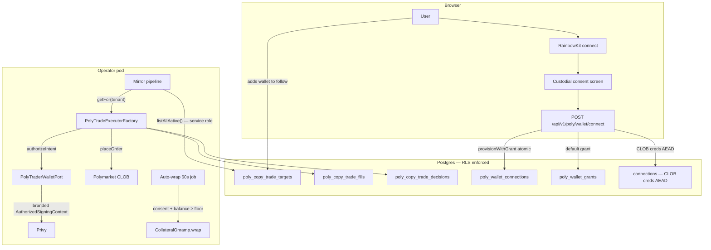

# Poly Tenant, Wallets & Collateral

This spec is the single contract for tenant isolation, per-tenant trading-wallet provisioning, execution authorization, and the USDC.e/pUSD collateral lifecycle. The mirror placement pipeline, planner policy, order/position lifecycle, redeem flow, and dashboard classification live in [`poly-copy-trade-execution.md`](./poly-copy-trade-execution.md).

## Goal

Define a tenant-isolated copy-trade system where:

- Each user manages their own list of wallets to mirror (`poly_copy_trade_targets`), with PostgreSQL RLS enforcing isolation at the database.
- Each user owns the on-chain wallet that places their mirrored trades (`poly_wallet_connections`), provisioned through the `PolyTraderWalletPort`.
- Autonomous placement runs under a revocable, connection-bound execution authorization (`poly_wallet_grants`), checked exactly once per intent at the `authorizeIntent` boundary.
- Polymarket V2 collateral mechanics (USDC.e ↔ pUSD wrap, auto-wrap consent loop, Enable Trading ceremony) are encapsulated in the port adapter so callers never reach for an exchange address directly.

## Non-Goals

- BYO raw private keys. Custody is restricted to recognized signing backends (Privy today; Safe+4337 / Turnkey are portable future adapters).
- Multiple actor wallets per tenant. One active `poly_wallet_connections` row per `billing_account_id`.
- Mid-flight cancellation when a grant is revoked. Revocation halts **future** placements; in-flight orders complete.
- DAO-treasury-funded trading. Per-user wallets only.
- Mirror placement policy, planner invariants, ledger transitions — those live in [`poly-copy-trade-execution.md`](./poly-copy-trade-execution.md).
- Withdraw / unwrap flow for pUSD → USDC.e (symmetric via the same Onramp; held for a future withdraw spec).

## Design

Sections below define the as-built tenancy model: a two-layer split (tracked wallets + actor wallets) sharing one `billing_account_id` tenant boundary, the `PolyTraderWalletPort` contract that abstracts the signing backend, the `authorizeIntent` fail-closed checkpoint that mints the branded `AuthorizedSigningContext`, the schema (tables + RLS policies + AEAD-at-rest for L2 creds), the USDC.e ↔ pUSD collateral lifecycle (Enable Trading ceremony + auto-wrap consent loop), and the user + agent onboarding flows. Load-bearing rules are captured under `## Invariants`.

## System overview



## Two layers, one tenancy model

| Layer               | Question it answers                                                                                 | Source-of-truth table                            | Port                    |
| ------------------- | --------------------------------------------------------------------------------------------------- | ------------------------------------------------ | ----------------------- |
| **Tracked wallets** | "Which Polymarket wallets is this user mirroring?"                                                  | `poly_copy_trade_targets`                        | `CopyTradeTargetSource` |
| **Actor wallets**   | "Which on-chain wallet places this user's mirror trades, and what execution caps gate that wallet?" | `poly_wallet_connections` + `poly_wallet_grants` | `PolyTraderWalletPort`  |

Both share the same tenant boundary: `billing_account_id` is the **data column** that names the financial owner. RLS policies key on either `created_by_user_id = current_setting('app.current_user_id', true)` (`poly_copy_trade_targets`) or on `EXISTS (SELECT 1 FROM billing_accounts ba WHERE ba.id = ... AND ba.owner_user_id = current_setting('app.current_user_id', true))` (`poly_wallet_*`). The EXISTS form is forward-compatible with multi-user-per-account: swap the EXISTS subquery for a `billing_account_members` join when that lands — no column change.

**App-side defense in depth.** RLS is the structural floor. App code MUST verify `row.billing_account_id === expected.tenantId` after every RLS-scoped SELECT — same pattern as `DrizzleConnectionBrokerAdapter.resolve()`. The defense check catches misconfig + future RBAC drift.

## Tenant resolution & bootstrap

| Caller                                                          | DB role                                       | RLS context                                                                                                                                                  |
| --------------------------------------------------------------- | --------------------------------------------- | ------------------------------------------------------------------------------------------------------------------------------------------------------------ |
| Authenticated HTTP route (CRUD on targets, connections, grants) | `app_user` (RLS enforced)                     | `withTenantScope(appDb, sessionUser.id, ...)`                                                                                                                |
| Mirror-pipeline cross-tenant enumerator                         | `app_service` (BYPASSRLS)                     | None — returns `(billing_account_id, created_by_user_id, target_wallet)` triples; per-tenant inner loop opens a `withTenantScope` for fills/decisions writes |
| Bootstrap operator                                              | `app_service` for seed; `app_user` thereafter | `COGNI_SYSTEM_PRINCIPAL_USER_ID` (`00000000-0000-4000-a000-000000000001`) + `COGNI_SYSTEM_BILLING_ACCOUNT_ID` (`00000000-0000-4000-b000-000000000000`)       |

The system tenant has no special bootstrap path for wallet provisioning — it provisions through the same `POST /api/v1/poly/wallet/connect` code path as any other tenant.

Per [database-rls](./database-rls.md) § `SERVICE_BYPASS_CONTAINED`: the service role's password lives in a separate env var the web runtime never sees.

## Signing backends

A single port `PolyTraderWalletPort` is the only seam any backend speaks to. `PolyTradeExecutor` never names a backend; it is parameterized by the port on construction.

| Backend                      | OSS       | Autonomous      | Connect UX                                                                                                                                          | Status                                                                                                        |
| ---------------------------- | --------- | --------------- | --------------------------------------------------------------------------------------------------------------------------------------------------- | ------------------------------------------------------------------------------------------------------------- |
| **Privy per-user**           | ❌ closed | ✅              | Email/social login; `PrivyPolyTraderWalletAdapter` provisions + signs inside a **separate** Privy app from the system operator wallet               | **Shipped (Phase B)**                                                                                         |
| Safe + ERC-4337 session keys | ✅        | ✅ within scope | RainbowKit connect → user signs ONE meta-tx granting a session key scoped to CTF + USDC.e approvals + CLOB order signing, bounded by $/day + expiry | Future OSS-hardening task; port-compatible                                                                    |
| Turnkey                      | partial   | ✅              | API-driven MPC                                                                                                                                      | Future; port-compatible                                                                                       |
| RainbowKit / wagmi alone     | ✅        | ❌ popup per tx | Connect-wallet UI only                                                                                                                              | Not a valid `PolyTraderWalletPort` impl on its own — bootstraps the Safe connection, not an autonomous signer |

`KEY_NEVER_IN_APP` holds for every backend: raw signing-key material lives in the HSM / Safe / MPC. The app stores only an opaque `backend_ref`. Polymarket L2 API creds (`apiKey + apiSecret + passphrase`) are stored as a `connections` row with `provider = 'polymarket_clob'` and resolved via the existing `ConnectionBrokerPort` — same AEAD envelope, same `CONNECTIONS_ENCRYPTION_KEY` env, same AAD shape.

### Why a new port (rejected alternatives)

| Approach                                                                                           | Verdict                                                                                                                                                                                                                                        |
| -------------------------------------------------------------------------------------------------- | ---------------------------------------------------------------------------------------------------------------------------------------------------------------------------------------------------------------------------------------------- |
| Extend `OperatorWalletPort` with `resolvePolyAccount(billingAccountId)` / `signPolymarketOrder`    | **Rejected.** Violates `OperatorWalletPort`'s `NO_GENERIC_SIGNING` invariant — the port is deliberately intent-only. Conflates the system-tenant operator wallet with per-user wallets that have different blast-radius and billing semantics. |
| Inline per-tenant signer resolution in `bootstrap/capabilities/poly-trade.ts`                      | **Rejected.** Leaks Privy SDK coupling + env-shape assumptions into `nodes/poly/app`, making a future backend swap a cross-cutting rewrite.                                                                                                    |
| **New `PolyTraderWalletPort` in a shared package, `PrivyPolyTraderWalletAdapter` as Phase B impl** | **Chosen.** Narrow interface, backend-agnostic, testable without real Privy, future adapters plug in without touching callers.                                                                                                                 |

## Authorization model — `authorizeIntent` is the fail-closed checkpoint

The placement pipeline splits cleanly into **pure planning** and **authorized signing**. Cap + scope checks live **inside the port adapter**, not inside the planner. The planner never names a grant, and `PolymarketClobAdapter.placeOrder` takes a branded `AuthorizedSigningContext` that only `authorizeIntent` can mint.

| Stage                                             | Where                                                                  | What it does                                                                                                                                                                          | What it MAY NOT do                                                         |
| ------------------------------------------------- | ---------------------------------------------------------------------- | ------------------------------------------------------------------------------------------------------------------------------------------------------------------------------------- | -------------------------------------------------------------------------- |
| 1. Enumerate tenants (cross-tenant, service-role) | `mirror-pipeline.ts` → `CopyTradeTargetSource.listAllActive`           | Return `(billing_account_id, created_by_user_id, target_wallet)` triples; joined against `poly_wallet_connections` + `poly_wallet_grants` so tenants without an active grant drop out | Read/write any per-tenant fill / decision / config row                     |
| 2. Dispatch to per-tenant executor                | `PolyTradeExecutorFactory.getFor(billingAccountId)`                    | Lazily build + cache a `PolyTradeExecutor` bound to the tenant's `PolyTraderWalletPort` + `ConnectionBroker`                                                                          | Touch grants                                                               |
| 3. Plan the mirror (pure)                         | `planMirrorFromFill` in `features/copy-trade/`                         | Map a source fill + mirror config → typed `MirrorPlan`. **No cap checks. No grant reads. No signer calls.**                                                                           | Reach into grants, env vars, or hardcoded cap constants                    |
| 4. **Authorize the intent**                       | `PolyTraderWalletPort.authorizeIntent(billingAccountId, intent)`       | SELECT active connection, check `trading_approvals_ready_at`, resolve active grant, validate scope, enforce caps, mint branded `AuthorizedSigningContext`                             | Mutate state, place an order, return a bare signer object                  |
| 5. Place the order                                | `PolymarketClobAdapter.placeOrder(ctx)` — `ctx` is the branded context | Sign + POST to CLOB                                                                                                                                                                   | Re-check caps / scope — already proven structurally by the branded context |

Outcomes that fail step 4 are recorded in `poly_copy_trade_decisions` with one of: `no_connection`, `trading_not_ready`, `no_active_grant`, `grant_expired`, `grant_revoked`, `scope_missing`, `cap_exceeded_per_order`, `cap_exceeded_daily`, `cap_exceeded_hourly_fills`, `backend_unreachable`. No row ever reaches step 5 without an `AuthorizedSigningContext`; the brand cannot be constructed from outside the adapter, which is how `AUTHORIZED_SIGNING_ONLY` is enforced structurally at the TypeScript level.

### `authorizeIntent` flow (as-built)

1. SELECT active `poly_wallet_connections` (un-revoked). Absent → `{ ok: false, reason: "no_connection" }`. `trading_approvals_ready_at IS NULL` → `{ ok: false, reason: "trading_not_ready" }` — **APPROVALS_BEFORE_PLACE**, ahead of grant/cap math so counters aren't consumed by wallets that cannot settle on-chain.
2. SELECT latest non-revoked grant from `poly_wallet_grants` (`ORDER BY created_at DESC LIMIT 1`). Absent → `"no_active_grant"`; expired → `"grant_expired"`.
3. Scope check: `"poly:trade:buy" in grant.scopes` for BUY, `"poly:trade:sell" in grant.scopes` for SELL. Missing → `"scope_missing"`.
4. `intent.usdcAmount > grant.per_order_usdc_cap` → `"cap_exceeded_per_order"`.
5. Windowed spend on `poly_copy_trade_fills` over 24h (statuses that commit USDC); `spent + intent.usdcAmount > grant.daily_usdc_cap` → `"cap_exceeded_daily"`.
6. Hourly fills window on the same table → `"cap_exceeded_hourly_fills"`.
7. `resolve(billingAccountId)` — if `null`, return `{ ok: false, reason: "no_connection" }` (stale grant vs. revoked connection edge).
8. Mint `AuthorizedSigningContext` and return `{ ok: true, context }`.

## Schema

### `poly_copy_trade_targets`

| Column               | Type        | Constraints                                             | Description                              |
| -------------------- | ----------- | ------------------------------------------------------- | ---------------------------------------- |
| `id`                 | uuid        | PK, default `gen_random_uuid()`                         |                                          |
| `billing_account_id` | text        | NOT NULL, FK → `billing_accounts(id)` ON DELETE CASCADE | Tenant boundary                          |
| `target_wallet`      | text        | NOT NULL, CHECK `~ '^0x[a-fA-F0-9]{40}$'`               | Polymarket wallet address being followed |
| `created_at`         | timestamptz | NOT NULL, DEFAULT `now()`                               |                                          |
| `created_by_user_id` | text        | NOT NULL, FK → `users(id)`                              | Audit + RLS key                          |
| `disabled_at`        | timestamptz | NULL                                                    | Soft delete                              |

Constraints:

- `UNIQUE (billing_account_id, target_wallet) WHERE disabled_at IS NULL` — one active row per (tenant, wallet)
- RLS: `USING (created_by_user_id = current_setting('app.current_user_id', true))` (mirrors `connections` migration 0025)

No per-target `enabled` flag, no per-target caps, no per-tenant kill-switch table. The cross-tenant enumerator's `target × connection × grant` join is the sole gate (`NO_KILL_SWITCH`, bug.0438). Per-tenant USDC caps live on `poly_wallet_grants`.

### `poly_copy_trade_fills` + `poly_copy_trade_decisions`

| Column                 | Type        | Constraints                                  | Description                                                                                                                                                      |
| ---------------------- | ----------- | -------------------------------------------- | ---------------------------------------------------------------------------------------------------------------------------------------------------------------- |
| `id`                   | uuid        | PK                                           |                                                                                                                                                                  |
| `billing_account_id`   | text        | NOT NULL, FK                                 | Tenant boundary                                                                                                                                                  |
| `created_by_user_id`   | text        | NOT NULL, FK                                 | Attribution + RLS key                                                                                                                                            |
| `target_id`            | uuid        | NOT NULL, FK → `poly_copy_trade_targets(id)` |                                                                                                                                                                  |
| `wallet_connection_id` | uuid        | NOT NULL, FK → `poly_wallet_connections(id)` | Which actor wallet placed the trade                                                                                                                              |
| `client_order_id`      | text        | NOT NULL                                     | `keccak256(target_id + ':' + fill_id)`                                                                                                                           |
| `order_id`             | text        | NULL                                         | CLOB order id once placed                                                                                                                                        |
| `status`               | text        | NOT NULL                                     | `pending / placed / failed / filled / cancelled` (see [`poly-copy-trade-execution.md`](./poly-copy-trade-execution.md) §Order status for the full state machine) |
| `created_at`           | timestamptz | NOT NULL                                     |                                                                                                                                                                  |
| `position_lifecycle`   | enum        | NULL                                         | Asset-scoped position state (see [`poly-copy-trade-execution.md`](./poly-copy-trade-execution.md) §Position lifecycle)                                           |
| `attributes`           | jsonb       | NOT NULL                                     | Includes `token_id`, `condition_id`, `size_usdc`, `limit_price`, `placement`, `position_branch`, `closed_at`, etc.                                               |

`poly_copy_trade_decisions` has the same RLS shape; every planner outcome (placed, skipped, errored) gets a row per `RECORD_EVERY_DECISION`.

Migration 0029 (`0029_poly_copy_trade_multitenant.sql`) added `billing_account_id` + `created_by_user_id` columns + RLS policies + the `poly_copy_trade_targets` table.

### `poly_wallet_connections` — actor-wallet metadata

| Column                          | Type        | Constraints                                             | Description                                                                                  |
| ------------------------------- | ----------- | ------------------------------------------------------- | -------------------------------------------------------------------------------------------- |
| `id`                            | uuid        | PK                                                      |                                                                                              |
| `billing_account_id`            | text        | NOT NULL, FK → `billing_accounts(id)` ON DELETE CASCADE | Tenant data column                                                                           |
| `created_by_user_id`            | text        | NOT NULL, FK → `users(id)`                              | Audit (not the RLS key — see policy below)                                                   |
| `backend`                       | text        | NOT NULL, CHECK `IN ('safe_4337','privy','turnkey')`    | Which `PolyTraderWalletPort` adapter owns this row                                           |
| `address`                       | text        | NOT NULL                                                | Checksummed wallet address (funder)                                                          |
| `chain_id`                      | int         | NOT NULL                                                | 137 (Polygon mainnet)                                                                        |
| `backend_ref`                   | text        | NOT NULL                                                | Opaque backend ID (Privy `walletId` / Safe address / Turnkey `subaccount_id`)                |
| `clob_connection_id`            | uuid        | NOT NULL, FK → `connections(id)` ON DELETE RESTRICT     | CLOB credentials live in `connections` row; provider check enforced app-side                 |
| `allowance_state`               | jsonb       | NULL                                                    | Last on-chain allowance snapshot                                                             |
| `trading_approvals_ready_at`    | timestamptz | NULL                                                    | Stamped by `ensureTradingApprovals` once all on-chain approvals succeed; cleared on `revoke` |
| `custodial_consent_accepted_at` | timestamptz | NULL                                                    | Single source of truth for `CUSTODIAL_CONSENT` (migration 0030)                              |
| `auto_wrap_consent_at`          | timestamptz | NULL                                                    | When the user enabled auto-wrap on the Money page                                            |
| `auto_wrap_revoked_at`          | timestamptz | NULL                                                    | When they revoked it; original `consent_at` preserved for forensics                          |
| `auto_wrap_floor_usdce_6dp`     | BIGINT      | NOT NULL DEFAULT `1_000_000`                            | Dust guard — minimum USDC.e to wrap (1.00 USDC.e default)                                    |
| `created_at`                    | timestamptz | NOT NULL                                                |                                                                                              |
| `last_used_at`                  | timestamptz | NULL                                                    | Stale-wallet detection                                                                       |
| `revoked_at`                    | timestamptz | NULL                                                    | Soft delete                                                                                  |
| `revoked_by_user_id`            | text        | NULL                                                    | Audit                                                                                        |

Constraints:

- `UNIQUE (billing_account_id) WHERE revoked_at IS NULL` — one active wallet per tenant
- `(chain_id, address)` MUST appear in at most one un-revoked row globally
- RLS: `EXISTS (SELECT 1 FROM billing_accounts ba WHERE ba.id = poly_wallet_connections.billing_account_id AND ba.owner_user_id = current_setting('app.current_user_id', true))` — **billing-account-ownership** form. Forward-compatible with agent principals (set `app.current_user_id` to the user the agent acts for) and multi-user-per-account (swap EXISTS for a `billing_account_members` join).

Migrations: 0030 (`0030_poly_wallet_connections.sql`), 0032 (`0032_poly_wallet_trading_approvals.sql`), 0035 (`0035_poly_auto_wrap_consent_loop.sql`).

### `poly_wallet_grants` — execution authorization

| Column                 | Type          | Constraints                                                    | Description                                            |
| ---------------------- | ------------- | -------------------------------------------------------------- | ------------------------------------------------------ |
| `id`                   | uuid          | PK                                                             |                                                        |
| `billing_account_id`   | text          | NOT NULL, FK                                                   | Tenant boundary (denormalized from connection for RLS) |
| `wallet_connection_id` | uuid          | NOT NULL, FK → `poly_wallet_connections(id)` ON DELETE CASCADE | Which actor wallet this grant authorizes               |
| `created_by_user_id`   | text          | NOT NULL, FK                                                   | Who issued the grant                                   |
| `scopes`               | text[]        | NOT NULL                                                       | e.g. `["poly:trade:buy", "poly:trade:sell"]`           |
| `per_order_usdc_cap`   | numeric(10,2) | NOT NULL                                                       |                                                        |
| `daily_usdc_cap`       | numeric(10,2) | NOT NULL                                                       |                                                        |
| `hourly_fills_cap`     | int           | NOT NULL                                                       |                                                        |
| `expires_at`           | timestamptz   | NULL                                                           | NULL = no expiry (recommend non-null in production)    |
| `created_at`           | timestamptz   | NOT NULL                                                       |                                                        |
| `revoked_at`           | timestamptz   | NULL                                                           | Soft delete                                            |
| `revoked_by_user_id`   | text          | NULL                                                           | Audit                                                  |

Constraints (migration `0031_poly_wallet_grants.sql`):

- `CHECK array_length(scopes, 1) > 0`
- `CHECK per_order_usdc_cap > 0` + `CHECK daily_usdc_cap > 0` + `CHECK hourly_fills_cap > 0`
- `CHECK daily_usdc_cap >= per_order_usdc_cap` — a single order can never exceed the day
- Partial index `poly_wallet_grants_active_idx ON (billing_account_id, created_at DESC) WHERE revoked_at IS NULL` — hot-path "latest non-revoked grant per tenant" read
- Partial index `poly_wallet_grants_connection_idx ON (wallet_connection_id) WHERE revoked_at IS NULL` — adapter.revoke cascade
- RLS: same billing-account-ownership EXISTS form as `poly_wallet_connections`

**Revoke semantics** (`REVOKE_CASCADES_FROM_CONNECTION`): when `PrivyPolyTraderWalletAdapter.revoke` flips `poly_wallet_connections.revoked_at`, the same transaction flips `revoked_at` on every grant whose `wallet_connection_id` matches. Enforced app-side (no DB trigger) so `revoked_by_user_id` flows uniformly.

> **Current product reality:** in v0, `poly_wallet_grants` is **not** yet a user-managed delegated-agent grant surface. The app auto-issues one default execution-cap grant during `POST /api/v1/poly/wallet/connect` (defaults: per-order $2, daily $10, hourly-fills 20). `authorizeIntent` consumes that row at the signing boundary. Richer actor-scoped grants are future work.

### `connections` — CLOB creds at rest (reused)

Polymarket L2 API creds are stored as a `connections` row with `provider = 'polymarket_clob'`. **Zero new crypto code, zero new env var, zero new AAD shape.**

- Add `'polymarket_clob'` to the `connections_provider_check` CHECK list.
- Credential blob (encrypted): `{ apiKey: string, apiSecret: string, passphrase: string }`.
- AAD: `{ billing_account_id, connection_id, provider: "polymarket_clob" }` — existing `AeadAAD` shape (`packages/node-shared/src/crypto/aead.ts`).
- Encryption key: `CONNECTIONS_ENCRYPTION_KEY` env (existing).
- Resolution: `connectionBroker.resolve(clobConnectionId, { actorId, tenantId })` returns the decrypted blob.

## Port contract — `PolyTraderWalletPort`

Lives in `packages/poly-wallet/src/port/poly-trader-wallet.port.ts`. The first adapter (`PrivyPolyTraderWalletAdapter`) is node-local at `nodes/poly/app/src/adapters/server/wallet/` because it depends on `@cogni/poly-db-schema` + `@cogni/db-client`. Future adapters (Safe+4337, Turnkey) plug into the same port without caller churn.

### Interface

```ts
export interface OrderIntentSummary {
  readonly side: "BUY" | "SELL";
  readonly usdcAmount: number; // decimal USDC, not atomic units
  readonly marketConditionId: string;
}

export interface PolyTraderSigningContext {
  /** viem `LocalAccount` that can sign EIP-712 order hashes. */
  readonly account: LocalAccount;
  /** Polymarket CLOB L2 API credentials. */
  readonly clobCreds: ApiKeyCreds;
  /** Checksummed funder address — MUST equal `account.address` for SignatureType.EOA. */
  readonly funderAddress: `0x${string}`;
  /** Maps 1:1 to `poly_wallet_connections.id`. */
  readonly connectionId: string;
}

declare const __authorized: unique symbol;
export type AuthorizedSigningContext = PolyTraderSigningContext & {
  readonly [__authorized]: true;
  /** `poly_wallet_grants.id` that authorized this intent. */
  readonly grantId: string;
  /** Intent the grant was checked against; placeOrder MUST NOT mutate. */
  readonly authorizedIntent: OrderIntentSummary;
};

export type AuthorizationFailure =
  | "no_connection"
  | "trading_not_ready"
  | "no_active_grant"
  | "grant_expired"
  | "grant_revoked"
  | "scope_missing"
  | "cap_exceeded_per_order"
  | "cap_exceeded_daily"
  | "cap_exceeded_hourly_fills"
  | "backend_unreachable";

export interface PolyTraderWalletPort {
  resolve(billingAccountId: string): Promise<PolyTraderSigningContext | null>;
  getAddress(billingAccountId: string): Promise<`0x${string}` | null>;
  provision(input: {
    billingAccountId: string;
    createdByUserId: string;
    custodialConsent: CustodialConsent;
  }): Promise<PolyTraderSigningContext>;
  revoke(input: {
    billingAccountId: string;
    revokedByUserId: string;
  }): Promise<void>;
  authorizeIntent(
    billingAccountId: string,
    intent: OrderIntentSummary
  ): Promise<
    | { ok: true; context: AuthorizedSigningContext }
    | { ok: false; reason: AuthorizationFailure }
  >;
  withdrawUsdc(input: {
    billingAccountId: string;
    destination: `0x${string}`;
    amountAtomic: bigint; // USDC.e has 6 decimals
    requestedByUserId: string;
  }): Promise<{ txHash: `0x${string}` }>;
  rotateClobCreds(input: {
    billingAccountId: string;
  }): Promise<PolyTraderSigningContext>;
  ensureTradingApprovals(
    billingAccountId: string
  ): Promise<EnsureApprovalsResult>;
  getConnectionSummary(billingAccountId: string): Promise<ConnectionSummary>;
  wrapIdleUsdcE(billingAccountId: string): Promise<WrapIdleResult>;
  setAutoWrapConsent(billingAccountId: string): Promise<void>;
  revokeAutoWrapConsent(billingAccountId: string): Promise<void>;
}
```

### Adapter behavior — `PrivyPolyTraderWalletAdapter`

Phase B default impl. Uses Privy **server wallets** (`privy.walletApi.create({ chain_type: "ethereum" })`) — one per tenant, fully app-custodial from Privy's perspective, Cogni-controlled from the app's perspective.

**Constructor dependencies** (injected by `bootstrap/poly-trader-wallet.ts`):

- `privyClient`: PrivyClient (distinct from the operator-wallet Privy app — see Env separation below)
- `privySigningKey`: signing key for the user-wallets app
- `serviceDb`: BYPASSRLS handle for the cross-tenant reads this adapter performs
- `credentialEnvelope`: AEAD envelope used by `@cogni/connections`
- `clobFactory(signer)`: returns `ApiKeyCreds`; injected so the adapter never imports `@polymarket/clob-client` directly
- `logger`: Pino

**`resolve(billingAccountId)`**:

1. `SELECT * FROM poly_wallet_connections WHERE billing_account_id = $1 AND revoked_at IS NULL LIMIT 1` on `serviceDb`.
2. Defense-in-depth equality check on `row.billing_account_id`.
3. `createViemAccount(privyClient, { walletId: row.privy_wallet_id, address: row.address, authorizationContext: { authorization_private_keys: [privySigningKey] } })`.
4. Decrypt `row.clob_api_key_ciphertext` via `credentialEnvelope.decrypt`.
5. Return `{ account, clobCreds, funderAddress: row.address, connectionId: row.id }`.
6. On any failure: log a sanitized warning (no ciphertext, no walletId in the message) and return `null`.

**`provision({ billingAccountId, createdByUserId, custodialConsent })`**:

1. `BEGIN` transaction.
2. `SELECT pg_advisory_xact_lock(hashtext($1))` — tenant-scoped lock held until COMMIT/ROLLBACK.
3. SELECT existing un-revoked row for this tenant; if present, COMMIT + return the signing context (idempotent).
4. Derive the per-tenant **generation counter** `g = count(rows_for_billing_account) + 1` (includes revoked rows; monotonic). Compute `idempotencyKey = "poly-wallet:${billingAccountId}:${g}"`.
5. `privyClient.wallets().create({ chain_type: "ethereum" }, { idempotencyKey })` → `{ walletId, address }`. Privy honors `privy-idempotency-key` at the HTTP layer — repeated calls with the same key return the same wallet.
6. `createViemAccount(...)` → `LocalAccount`.
7. `clobFactory(account)` → `ApiKeyCreds` via Polymarket `/auth/api-key`. The production implementation wraps the Privy `LocalAccount` in `createWalletClient({ account, chain: polygon, transport: http() })`, dynamically imports `ClobClient`, then calls `createOrDeriveApiKey()` — itself idempotent per signer.
8. `credentialEnvelope.encrypt(JSON.stringify(creds))` → `{ ciphertext, encryptionKeyId }`.
9. INSERT `poly_wallet_connections` row.
10. COMMIT + return the `PolyTraderSigningContext`.

Any failure at steps 5–9 rolls back the transaction. On retry: the generation counter is recomputed from the same DB state → the same `idempotencyKey` → Privy returns the **same** wallet (no new wallet minted), CLOB returns the **same** creds, INSERT succeeds. **Retries converge; orphans cannot be created from crash-mid-provision** (`NO_ORPHAN_BACKEND_WALLETS`).

After a successful `revoke`, the revoked row still counts toward the generation counter, so the next `provision` computes a higher `g` and receives a **new** Privy wallet — the connect→revoke→connect cycle intentionally does not reuse the revoked wallet.

**Connect-route abuse bounding**: HTTP layer imposes per-tenant rate limit (default: at most one provision or revoke within a 5-minute window per `billing_account_id`). Enforced in `app/api/v1/poly/wallet/connect/route.ts`, not in the port — the port must remain idempotent under arbitrary retry pressure.

**`revoke({ billingAccountId, revokedByUserId })`**:

1. `UPDATE poly_wallet_connections SET revoked_at = now(), revoked_by_user_id = $2 WHERE billing_account_id = $1 AND revoked_at IS NULL`.
2. Same transaction cascades `revoked_at` on every `poly_wallet_grants` row with the matching `wallet_connection_id`.
3. Same transaction clears `trading_approvals_ready_at`.

No Privy-side action. The backend wallet is retained because it may still hold user funds. A subsequent `provision` for the same tenant creates a **new** connection with a **new** address; funds on the old address are the tenant's responsibility to withdraw via `withdrawUsdc` **before** revoking (`WITHDRAW_BEFORE_REVOKE`).

**`ensureTradingApprovals(billingAccountId)`** — the 8-step ceremony (see §Collateral lifecycle below for the wrap step):

1. Requires active connection + `POLYGON_RPC_URL`. Pre-reads USDC.e `allowance` calls + CTF `isApprovedForAll` + native POL balance; skips targets already at `maxUint256` / `true`.
2. If remaining work > 0 and POL balance is below a fixed minimum (~0.02 POL), returns `{ ready: false, steps[] }` with `skipped` / `insufficient_pol_gas` — **no txs submitted**.
3. Otherwise submits remaining approvals **sequentially** (nonce-safe). Each write waits for receipt + post-verifies state at `receipt.blockNumber`. The 8 steps are listed in §Collateral lifecycle.
4. On full success, `UPDATE poly_wallet_connections SET trading_approvals_ready_at = now()`. Partial failure leaves the column null; caller retries idempotently. HTTP: `POST /api/v1/poly/wallet/enable-trading` (session auth).

**`getConnectionSummary(billingAccountId)`** — DB-only: `connection_id`, `funder_address`, `trading_approvals_ready_at`. Powers `GET /api/v1/poly/wallet/status` without Privy or decrypt.

**`withdrawUsdc(...)`** — uses `walletClient.writeContract` to transfer USDC.e to a destination. Sanity check `destination !== context.funderAddress`. Gas paid from the tenant's MATIC balance at the funder address.

**`rotateClobCreds(...)`** — calls Polymarket `/auth/api-key` rotation, re-encrypts, updates `clob_api_key_ciphertext` + bumps `encryption_key_id`. The wallet address and `privy_wallet_id` are unchanged. Idempotent.

### What the adapter deliberately does NOT do

- **No generic calldata signing.** `ensureTradingApprovals` only emits the 8 pinned Polymarket approval/wrap calls; it is not a general-purpose transaction surface.
- **No shared-state memoization.** Every `resolve` call re-reads the DB. Upstream may LRU-cache the result keyed on `connectionId`.
- **No emergency cancel.** `authorizeIntent` gates future placements; it does not touch in-flight orders.

### Env — separation of system and user-wallet Privy apps

**Load-bearing design decision.** The operator wallet and per-tenant wallets use **separate Privy apps**. The argument is **Privy-side operational isolation**, not intra-cluster blast radius (both apps' API keys live in the same k8s secret store).

1. **Privy-side single-app failure modes.** Privy's rate limits, anomaly-detection triggers, and admin-initiated disables are enforced per-app. If a bug in AI-fee forwarding code pumps operator txns and Privy rate-limits or disables that app, co-located user wallets would die with it.
2. **Per-app audit cleanliness.** Privy's audit log is per-app. System-ops traffic (Splits distribution, OpenRouter top-ups) vs. user-wallet traffic (CLOB order signs, per-tenant provision calls) is clearly separable.
3. **Independent rotation cadence.** Rotating the system app's signing key must not invalidate every user's trading wallet.
4. **Privy product-tier alignment.** Two apps grow at different rates and may eventually qualify for different Privy plans / SLAs.
5. **Compliance / custody posture** (speculative). Two populations may take different legal paths.

```bash
# Existing — operator wallet (system tenant). Unchanged.
PRIVY_APP_ID=
PRIVY_APP_SECRET=
PRIVY_SIGNING_KEY=

# Per-tenant Polymarket trading wallets. Distinct Privy app.
PRIVY_USER_WALLETS_APP_ID=
PRIVY_USER_WALLETS_APP_SECRET=
PRIVY_USER_WALLETS_SIGNING_KEY=
```

Candidate-a + preview + production all get the new `PRIVY_USER_WALLETS_*` triple wired through `scripts/ci/deploy-infra.sh` + the candidate-flight-infra workflow. Missing or empty values fail-closed: `PrivyPolyTraderWalletAdapter.resolve` returns `null` and the coordinator skips the tenant.

## Mirror enumerator — the only cross-tenant path

The autonomous 30s mirror-pipeline cannot operate inside a single user's RLS scope (it iterates many tenants). Resolution: **one** read uses the `app_service` role to enumerate `(billing_account_id, created_by_user_id, target_wallet)` triples across all tenants with:

- an active `poly_copy_trade_targets` row, AND
- an active `poly_wallet_connections` row, AND
- at least one active `poly_wallet_grants` row.

Every subsequent operation runs under `withTenantScope(appDb, created_by_user_id, ...)` so RLS still enforces isolation for fills/decisions writes.

Per-tenant dispatch then goes through `PolyTradeExecutorFactory.getFor(billingAccountId)`, which lazily constructs (and caches) a `PolyTradeExecutor` bound to that tenant's `PolyTraderWalletPort` + `ConnectionBroker`. The factory is the **only** place that crosses the tenant/signer boundary — from there on, every call is tenant-scoped by construction.

**`POLL_RECONCILES_PER_TICK`**: the enumerator runs `listAllActive()` on every tick (30s cadence), not once at container boot. A reconciler diffs the returned set against a `Map<(billingAccountId, targetWallet), MirrorJobStopFn>`: `start` for newly-active targets, stored stop-fn invoked for removed targets. Mid-flight POSTs/DELETEs are reflected in ≤30s without a pod restart. Per-tick emission: `poly.mirror.targets.reconcile.tick { active_targets, added, removed, total_running }`.

## Collateral lifecycle — USDC.e ↔ pUSD on Polymarket V2

### Mental model

- **USDC.e** = how money enters/exits a wallet (the public Polygon stablecoin).
- **pUSD** = how money trades inside Polymarket V2 (the protocol-internal stablecoin).
- **CollateralOnramp** = the airlock between them. 1:1 in either direction, no fee.

V2 introduced pUSD to give Polymarket protocol-level control of the trade collateral (cross-chain, fee mechanics, accounting). The wrap step is a one-time-per-deposit cost, not a per-trade cost.

### Is USDC.e phased out?

**On Polymarket: yes, for trading. As an asset on Polygon: no.**

| Question                                                                           | Answer                                                                                              |
| ---------------------------------------------------------------------------------- | --------------------------------------------------------------------------------------------------- |
| Can V2 exchanges spend USDC.e to fill orders?                                      | **No.** They only spend pUSD.                                                                       |
| Will deposits from outside (Coinbase, bridges, personal wallets) arrive as USDC.e? | **Yes** — USDC.e is the standard Polygon stablecoin; pUSD exists only inside Polymarket's protocol. |
| Does our flow still need USDC.e approvals?                                         | Only one: `USDC.e.approve(CollateralOnramp, ∞)` so Onramp can pull deposits to mint pUSD.           |
| Wrap rate?                                                                         | **1:1.** No fee, no slippage, no peg risk.                                                          |
| Can pUSD be unwrapped back to USDC.e?                                              | **Yes**, via the same Onramp. Not exposed in our app yet.                                           |

### Contract addresses (Polygon mainnet, V2)

Sourced from `@polymarket/clob-client-v2`'s `getContractConfig(137)` plus one hardcode (CollateralOnramp is not in SDK config):

| Role                | Address                                      | Notes                                        |
| ------------------- | -------------------------------------------- | -------------------------------------------- |
| `USDC.e`            | `0x2791Bca1f2de4661ED88A30C99A7a9449Aa84174` | Standard Polygon-native USDC, hardcoded      |
| `pUSD`              | `0xC011a7E12a19f7B1f670d46F03B03f3342E82DFB` | SDK config field: `collateral`               |
| `CollateralOnramp`  | `0x93070a847efEf7F70739046A929D47a521F5B8ee` | Hardcoded; exposes `wrap(asset, to, amount)` |
| `ExchangeV2`        | `0xE111180000d2663C0091e4f400237545B87B996B` | SDK: `exchangeV2`                            |
| `NegRiskExchangeV2` | `0xe2222d279d744050d28e00520010520000310F59` | SDK: `negRiskExchangeV2`                     |
| `NegRiskAdapter`    | `0xd91E80cF2E7be2e162c6513ceD06f1dD0dA35296` | SDK: `negRiskAdapter` — unchanged from V1    |
| `CTF`               | `0x4D97DCd97eC945f40cF65F87097ACe5EA0476045` | SDK: `conditionalTokens` — unchanged from V1 |

### Enable Trading ceremony — 8 steps

`PolyTraderWalletPort.ensureTradingApprovals` performs these idempotently. Each step checks live state and skips when satisfied:

1. `USDC.e.approve(CollateralOnramp, MaxUint256)` — lets Onramp pull USDC.e.
2. `CollateralOnramp.wrap(USDC.e, funder, balance)` — mints `balance` pUSD to the funder; consumes the USDC.e. **The only stateful balance-moving call.**
3. `pUSD.approve(ExchangeV2, MaxUint256)`
4. `pUSD.approve(NegRiskExchangeV2, MaxUint256)`
5. `pUSD.approve(NegRiskAdapter, MaxUint256)` — belt-and-suspenders; adapter target may not always pull pUSD.
6. `CTF.setApprovalForAll(ExchangeV2, true)`
7. `CTF.setApprovalForAll(NegRiskExchangeV2, true)`
8. `CTF.setApprovalForAll(NegRiskAdapter, true)`

After the first run, the seven non-wrap approvals are sticky on-chain. Only step 2 needs to recur — that's what the auto-wrap loop handles.

### Auto-wrap consent loop (task.0429)

Three of four cash-return channels deliver USDC.e:

| Channel                               | Token landed |
| ------------------------------------- | ------------ |
| Money-page deposit                    | USDC.e       |
| V1 CTF redeem (pre-cutover positions) | USDC.e       |
| V2 CTF redeem (post-cutover)          | pUSD         |
| External transfer to funder           | USDC.e       |

Without intervention, three of these strand cash until the user clicks Enable Trading again. The auto-wrap loop closes that gap with a single user consent + a background job.

```
funder ──USDC.e──▶ [60s scan: consent + balance ≥ floor]
                            │
                            ▼
                  CollateralOnramp.wrap(...)
                            │
                            ▼
funder ──pUSD──▶ CLOB BUY ──▶ CTF position ──▶ resolves ──▶ redeem
   ▲                                                          │
   └──────────── USDC.e (V1) / pUSD (V2) ◀────────────────────┘
```

**How it works** — one click, perpetual loop:

- User flips **Auto-wrap USDC.e → pUSD** on the Money page once. Stamps `poly_wallet_connections.auto_wrap_consent_at`.
- The trader pod runs a 60s `bootstrap/jobs/auto-wrap.job.ts` (modeled on `order-reconciler.job.ts`). Every tick:
  1. Reads consenting + non-revoked rows from `poly_wallet_connections`.
  2. Reads on-chain USDC.e balance at the funder address.
  3. If balance ≥ `auto_wrap_floor_usdce_6dp` (default `1_000_000` = 1.00 USDC.e), submits the pinned `CollateralOnramp.wrap(USDC.e, funder, balance)` call.
- Revoke flips `auto_wrap_revoked_at`. Next tick observes it and skips the row.

Read-then-act, not event-driven — every tick re-derives the decision from current on-chain balance + current DB consent. A revoke is honored on the next tick with no extra plumbing.

**Skip outcomes** (returned as `{ outcome: "skipped", reason }` from `wrapIdleUsdcE`):

| Reason            | Meaning                                                |
| ----------------- | ------------------------------------------------------ |
| `no_consent`      | `auto_wrap_consent_at IS NULL` or revoked since        |
| `no_balance`      | USDC.e balance is exactly 0                            |
| `below_floor`     | Balance > 0 but < the floor — DUST_GUARD               |
| `not_provisioned` | No active `poly_wallet_connections` row for the tenant |

Throws (RPC unreachable, decryption error, Privy backend down) are caught at the job's per-row level and counted as `outcome: "errored"`; they never escape the interval.

### Floor — the dust guard

`auto_wrap_floor_usdce_6dp` (BIGINT NOT NULL DEFAULT `1_000_000`) is the minimum atomic USDC.e the job will wrap. Below floor → skip. Without this a malicious actor sending 1 wei USDC.e per minute could drain the funder's POL via wrap-tx gas fees. Per-connection; v0 ships with the field hidden in UI.

### What our app does with each token

| Path                                    | Reads / writes                                                                                                                                           |
| --------------------------------------- | -------------------------------------------------------------------------------------------------------------------------------------------------------- |
| Display "trading balance" on Money page | Sum **USDC.e + pUSD** on-chain. Both 1:1 USD. (`readPolygonBalances` reads both and sums into the `usdcE` field name kept for now.)                      |
| Enable Trading button                   | Wraps **all** USDC.e → pUSD on click. Steady state: USDC.e ≈ 0, pUSD = wallet balance.                                                                   |
| Mirror BUY                              | Spends **pUSD** via V2 exchange. USDC.e is never touched at trade time.                                                                                  |
| New deposit lands as USDC.e             | If auto-wrap is on, converted within ≤90s. Without auto-wrap, sits until next Enable Trading click. UI shows correct total because we sum both balances. |
| V1 CTF redeem returns cash              | Pre-cutover positions redeem to USDC.e. Same auto-wrap path picks them up. Post-cutover (V2) redeems land pUSD directly.                                 |

## Onboarding flows

### User onboarding (dashboard, B3)

```
Step 1  Connect wallet (card on Poly dashboard)
         ├─ "Cogni will create a Polymarket trading wallet for you."
         └─ [Start setup] →

Step 2  Custodial consent screen (CUSTODIAL_CONSENT)
         ├─ Plain-English disclosure (Privy custody, Cogni-controlled trading,
         │  recovery caveats, withdrawal is always available).
         ├─ Checkbox: "I understand Cogni holds this wallet via Privy."
         └─ [I understand] → persists custodial_consent_accepted_at

Step 3  Backend call: polyTraderWallet.provision({...})
         ├─ Advisory-locked, idempotent.
         ├─ Server-side only — Privy app secret never touches the browser.
         └─ Returns { funderAddress, connectionId }

Step 4  Fund prompt
         ├─ QR + copy-to-clipboard of the funderAddress.
         ├─ Live USDC.e + MATIC balance poll.
         ├─ "You need ~$5 USDC.e + ~0.1 MATIC to start."
         └─ When balances cross threshold → auto-advance.

Step 5  Allowance setup (Enable Trading)
         ├─ One-click: "Authorize Polymarket contracts."
         ├─ Runs the 8-step ceremony with the tenant's signer.
         └─ Stamps trading_approvals_ready_at.

Step 6  Grant issuance
         ├─ Default grant auto-created: per-order $2, daily $10,
         │  hourly-fills 20 — operator-safe defaults.
         └─ "You can tighten these in settings."

Step 7  Done state
         ├─ "Your trading wallet is ready."
         └─ Shows funderAddress + balance + Withdraw / Disconnect actions.
```

At any point: **Withdraw** sends USDC.e to an external address. **Disconnect** surfaces a warning listing the current balance and requires withdraw-first if funds are present (`WITHDRAW_BEFORE_REVOKE`).

### Agent onboarding (API)

```http
POST /api/v1/poly/wallet/connect
Authorization: Bearer <agent-api-key bound to billingAccountId>
Content-Type: application/json

{
  "custodialConsentAcknowledged": true,
  "custodialConsentActorKind": "agent",
  "custodialConsentActorId": "<agent-api-key-id>"
}

→ 200 {
  "connection_id": "...",
  "funder_address": "0x...",
  "requires_funding": true,
  "suggested_usdc": 5,
  "suggested_matic": 0.1
}
```

- The agent API key must carry the `poly:wallet:provision` scope, minted by a user. Absent → 403.
- `custodialConsentAcknowledged: true` is only valid when the agent's minting user has themselves accepted the disclosure; otherwise 409.
- Funding is the agent's operational responsibility. Polling endpoint `GET /api/v1/poly/wallet/status` reports `{ funded, allowances_set, ready }`.
- Allowances: agent calls `POST /api/v1/poly/wallet/enable-trading` once funded.
- Grants: defaults apply; agent may tighten via `POST /api/v1/poly/wallet/grants`.

**System-tenant bootstrap**: same code path. The system agent provisions its wallet at first boot via the same `POST /connect` route — no `system is special` branches.

## HTTP routes

| Route                                                   | Auth                     | Body                                                 | Effect                                                                                            |
| ------------------------------------------------------- | ------------------------ | ---------------------------------------------------- | ------------------------------------------------------------------------------------------------- |
| `POST /api/v1/poly/wallet/connect`                      | Session OR agent-API-key | `custodialConsentAcknowledged: true` + actor kind/id | Atomic `provisionWithGrant`. Rate limit: ≤1 per 5min per tenant                                   |
| `GET /api/v1/poly/wallet/status`                        | Session OR agent         | —                                                    | `{ funded, allowances_set, ready }`                                                               |
| `GET /api/v1/poly/wallet/balances`                      | Session                  | —                                                    | On-chain USDC.e + pUSD + MATIC at the funder                                                      |
| `POST /api/v1/poly/wallet/enable-trading`               | Session                  | —                                                    | Runs `ensureTradingApprovals`                                                                     |
| `POST /api/v1/poly/wallet/grants`                       | Session                  | scope + cap updates                                  | Tighten defaults                                                                                  |
| `POST /api/v1/poly/wallet/withdraw`                     | Session                  | `destination`, `amount`                              | `withdrawUsdc`                                                                                    |
| `POST /api/v1/poly/wallet/auto-wrap`                    | Session                  | `consent: bool`                                      | Toggle `auto_wrap_consent_at` / `auto_wrap_revoked_at`                                            |
| `GET /api/v1/poly/wallet/balance`                       | (legacy)                 | —                                                    | **Tombstone** returning `{ stale: true, error_reason: "operator_wallet_removed_use_money_page" }` |
| `GET/POST/DELETE /api/v1/poly/copy-trade/targets[/:id]` | Session                  | target_wallet                                        | CRUD on `poly_copy_trade_targets` (RLS-clamped)                                                   |

## Invariants

### Tenant isolation

- **`TENANT_SCOPED_ROWS`** — every `poly_copy_trade_*` and `poly_wallet_*` table has `billing_account_id NOT NULL` (data column, FK → `billing_accounts(id)` ON DELETE CASCADE) + `created_by_user_id NOT NULL` (audit, FK → `users(id)`) + RLS policy on the user-ownership clamp.
- **`TENANT_DEFENSE_IN_DEPTH`** — after every RLS-scoped SELECT, app code verifies `row.billing_account_id === expected.tenantId`. Catches misconfig + future multi-user-per-account RBAC drift.
- **`TARGET_SOURCE_TENANT_SCOPED`** — `CopyTradeTargetSource.listForActor({ billingAccountId })` returns only that tenant's rows under `appDb` (RLS-enforced). The cross-tenant enumerator is a separate, explicitly named method (`listAllActive()`) that runs under `app_service`.
- **`TARGET_POST_IS_OPT_IN`** — `POST /api/v1/poly/copy-trade/targets` writes only `poly_copy_trade_targets`. The act of POSTing a target IS the opt-in. Stopping the mirror loop for a tenant is done via DELETE on the target row (or revoking the grant / connection).
- **`POLL_RECONCILES_PER_TICK`** — `listAllActive()` runs every 30s; a reconciler diffs the active set and starts/stops per-target polls. Mid-flight POSTs/DELETEs reflected in ≤30s.
- **`CROSS_TENANT_ISOLATION_TESTED`** — a two-tenant integration test proves user-A cannot SELECT/INSERT/UPDATE/DELETE user-B's targets / connections / grants / fills / decisions via `appDb`.
- **`FAIL_CLOSED_ON_DB_ERROR`** — any DB read failure during grant or config resolution treats the tenant as disabled (no placements). RLS denying-by-zero-rows counts as "disabled," not as an error to retry-and-place.

### Wallet & grants

- **`GRANT_REQUIRED_FOR_PLACEMENT`** — `PolyTraderWalletPort.authorizeIntent` MUST resolve a non-revoked `poly_wallet_grants` row before returning a branded `AuthorizedSigningContext`. `placeOrder` is structurally unreachable without one.
- **`SCOPES_ENFORCED`** — `poly:trade:buy` for BUY, `poly:trade:sell` for SELL. Missing → skip with `reason = scope_missing`.
- **`NO_KILL_SWITCH`** (bug.0438) — copy-trade has no per-tenant kill-switch table. The `target × connection × grant` join is the sole gate.
- **`CAPS_ENFORCED_PER_GRANT`** — `authorizeIntent` reads `per_order_usdc_cap` / `daily_usdc_cap` / `hourly_fills_cap` from the resolved grant. Env vars or hardcoded constants are a violation.
- **`CAPS_LIVE_IN_GRANT`** — caps are enforced in `authorizeIntent` against the `poly_wallet_grants` row, never in the planner. (Cross-reference: [`poly-copy-trade-execution.md`](./poly-copy-trade-execution.md) §Caps + authorization.)
- **`REVOCATION_HALTS_PLACEMENT`** — setting `poly_wallet_grants.revoked_at = now()` halts placement from the next poll cycle. In-flight orders complete; no new orders place. Recorded as `reason = no_active_grant`.
- **`REVOKE_CASCADES_FROM_CONNECTION`** — connection revoke flips `revoked_at` on every grant whose `wallet_connection_id` matches, in the same transaction (app-side, no DB trigger), so `revoked_by_user_id` flows uniformly.
- **`ONE_ACTIVE_WALLET_PER_TENANT`** — at most one `poly_wallet_connections` row per tenant where `revoked_at IS NULL`. Partial unique index.
- **`ADDRESS_NOT_REUSED_ACROSS_TENANTS`** — `(chain_id, address)` appears in at most one un-revoked row globally.
- **`CLOB_BOUND_TO_WALLET`** — Polymarket CLOB credentials are derived from an EIP-712 signature by the wallet that owns them; Polymarket enforces 1:1 binding. One CLOB credset per wallet; sharing across `poly_wallet_connections` rows is forbidden by Polymarket itself.

### Port contract

- **`TENANT_SCOPED`** — every port method takes a `billingAccountId`. No "current" state inside the adapter.
- **`NO_GENERIC_SIGNING`** — the port does not expose `signMessage(bytes)` / `signTransaction(calldata)`. Only intent-typed methods.
- **`KEY_NEVER_IN_APP`** — no raw private key material in the app process; backend holds custody. Only opaque `backend_ref` + AEAD-encrypted L2 creds.
- **`SIGNING_BACKEND_PORTABLE`** — `PolyTradeExecutor` + `PolyTradeExecutorFactory` depend only on `PolyTraderWalletPort`. Adding a new backend is a new adapter + a `backend` enum value — zero changes to the executor, factory, or mirror pipeline.
- **`FAIL_CLOSED_ON_RESOLVE`** — `resolve` returns `null` (never a stub signer) when credentials are unavailable. The executor treats `null` as "skip this tenant this tick."
- **`CONTEXT_IS_READ_ONLY`** — the returned signing-context bundle is frozen; callers must not mutate.
- **`CREDS_ENCRYPTED_AT_REST`** — CLOB API creds stored via the existing `connections` AEAD envelope. Reused, not reinvented.
- **`PROVISION_IS_IDEMPOTENT`** — calling `provision` twice for the same tenant (concurrently or sequentially) returns the same connection. Advisory-locked + deterministic idempotency key; partial failures roll back inside the lock.
- **`REVOKE_IS_DURABLE`** — `revoked_at` is the authoritative kill-switch; the executor's `resolve` call is the only enforcement point. Halt-future-only.
- **`SEPARATE_PRIVY_APP`** — the Privy adapter MUST NOT read `PRIVY_APP_ID` / `PRIVY_APP_SECRET` / `PRIVY_SIGNING_KEY` (those are the system / operator-wallet app). It reads `PRIVY_USER_WALLETS_*`. The adapter is constructor-injected with a `PrivyClient` + signing key, so it stays env-free.
- **`AUTHORIZED_SIGNING_ONLY`** — `PolymarketClobAdapter.placeOrder` accepts `AuthorizedSigningContext` (branded), not `PolyTraderSigningContext`. Grant scope + cap bypass is a compile error.
- **`APPROVALS_BEFORE_PLACE`** — `authorizeIntent` reads `trading_approvals_ready_at` BEFORE grant/cap math. If null → `{ ok: false, reason: "trading_not_ready" }`. Cleared in the same transaction as `revoked_at`.
- **`APPROVAL_TARGETS_PINNED`** — the three USDC.e spenders and three CTF operators are mainnet constants in `PrivyPolyTraderWalletAdapter`. No env override, no user input — prevents approving an arbitrary spender.
- **`APPROVAL_TARGETS_FROM_SDK_CONFIG`** — exchange + collateral + CTF + adapter addresses are derived from `clob-client-v2`'s `getContractConfig(137)`. CollateralOnramp is the one hardcoded address (not in SDK config). No env override.
- **`NO_ORPHAN_BACKEND_WALLETS`** — `provision` passes a deterministic `idempotencyKey` to Privy. Retries converge on the same backend wallet even if the DB transaction fails mid-provision; crash-mid-provision is self-healing on retry.
- **`WITHDRAW_BEFORE_REVOKE`** — the dashboard MUST expose manual `withdrawUsdc` before offering `revoke`. Stranding funds at a revoked address is a UX failure mode.
- **`CUSTODIAL_CONSENT`** — plain-English disclosure ships in the B3 onboarding flow. The tenant's acknowledgement is persisted (`poly_wallet_connections.custodial_consent_accepted_at`) before `provision` is permitted. Enforced at **two layers**: HTTP Zod (`poly.wallet.connection.v1` requires `custodialConsentAcknowledged: true`) + TypeScript port (`provision({ custodialConsent: CustodialConsent })`). Single source of truth, two layers of enforcement.

### Collateral

- **`TRADES_SPEND_PUSD`** — V2 exchanges only pull pUSD from a wallet at fill time. Granting them USDC.e allowance is a no-op and silently fails as `insufficient_balance` at the CLOB.
- **`WRAP_IS_1_TO_1`** — `CollateralOnramp.wrap(USDC.e, to, n)` mints exactly `n` units of pUSD to `to` and consumes exactly `n` USDC.e. No fee, no slippage.
- **`ONRAMP_NEEDS_USDC_E_ALLOWANCE`** — `wrap` pulls USDC.e via `transferFrom`; caller MUST first `USDC.e.approve(CollateralOnramp, …)`.
- **`BALANCE_DISPLAY_IS_SUM`** — UI / overview-API "trading balance" reads both USDC.e and pUSD on-chain and shows the sum. Makes a pre-wrap deposit visible to the operator without needing to wrap first.
- **`ENABLE_TRADING_IS_THE_BRIDGE`** — every wallet runs the 8-step ceremony once per env. Idempotent; each step checks live state and skips when satisfied. After the first run, the seven non-wrap approvals are sticky; only the wrap step needs to recur (auto-wrap handles it).
- **`AUTO_WRAP_ON_CONSENT`** — when `auto_wrap_consent_at IS NOT NULL AND auto_wrap_revoked_at IS NULL AND revoked_at IS NULL`, the trader pod's 60s `auto-wrap.job` MAY submit `CollateralOnramp.wrap(...)` whenever USDC.e balance ≥ `auto_wrap_floor_usdce_6dp`. Read-then-act per tick; a revoke is honored on the next tick.
- **`DUST_GUARD`** — the auto-wrap job MUST skip rows where USDC.e balance is below `auto_wrap_floor_usdce_6dp` (default `1_000_000`). Prevents gas-on-dust drain via flood of 1-wei transfers.

## Implementation pointers

### Port + adapter

- `packages/poly-wallet/src/port/poly-trader-wallet.port.ts` — `PolyTraderWalletPort` interface, `AuthorizedSigningContext` branded type.
- `nodes/poly/app/src/adapters/server/wallet/privy-poly-trader-wallet.adapter.ts` — `PrivyPolyTraderWalletAdapter`. `readPolygonBalances`, `ensureTradingApprovals`, `submitCollateralWrap`, `wrapIdleUsdcE`, `setAutoWrapConsent`, `revokeAutoWrapConsent`.
- `nodes/poly/app/src/bootstrap/poly-trader-wallet.ts` — bootstrap wiring (config + Privy client construction).

### Tables + migrations

- `nodes/poly/packages/db-schema/src/copy-trade.ts` — `polyCopyTradeTargets`, `polyCopyTradeFills`, `polyCopyTradeDecisions`.
- `nodes/poly/packages/db-schema/src/wallet-connections.ts` — `polyWalletConnections` with auto-wrap columns.
- `nodes/poly/packages/db-schema/src/wallet-grants.ts` — `polyWalletGrants`.
- Migrations:
  - `0029_poly_copy_trade_multitenant.sql` — `billing_account_id` + RLS on copy-trade tables; creates `poly_copy_trade_targets`.
  - `0030_poly_wallet_connections.sql` — wallet metadata + RLS keyed on `billing_accounts.owner_user_id`; adds `custodial_consent_accepted_at`.
  - `0031_poly_wallet_grants.sql` — execution-grant table + partial indexes + CHECK constraints.
  - `0032_poly_wallet_trading_approvals.sql` — `trading_approvals_ready_at` column (`APPROVALS_BEFORE_PLACE`).
  - `0034_poly_redeem_jobs_collateral_token.sql` — collateral-vintage column on redeem jobs.
  - `0035_poly_auto_wrap_consent_loop.sql` — auto-wrap consent/revoke/floor columns + partial index.

### Routes

- `nodes/poly/app/src/app/api/v1/poly/wallet/connect/route.ts` — atomic `provisionWithGrant` (POST) + status (GET).
- `nodes/poly/app/src/app/api/v1/poly/wallet/enable-trading/route.ts` — runs `ensureTradingApprovals`.
- `nodes/poly/app/src/app/api/v1/poly/wallet/balances/route.ts` — sums USDC.e + pUSD.
- `nodes/poly/app/src/app/api/v1/poly/wallet/withdraw/route.ts` — `withdrawUsdc`.
- `nodes/poly/app/src/app/api/v1/poly/wallet/status/route.ts` — `getConnectionSummary`.
- `nodes/poly/app/src/app/api/v1/poly/wallet/grants/route.ts` — grant CRUD.
- `nodes/poly/app/src/app/api/internal/ops/poly/wallet/rotate-clob-creds/route.ts` — `rotateClobCreds`.
- `nodes/poly/app/src/app/api/v1/poly/copy-trade/targets/route.ts` + `[id]/route.ts` — target CRUD.
- `nodes/poly/app/src/app/api/v1/poly/wallet/balance/route.ts` — tombstone (legacy contract compat).

### Contracts (`packages/node-contracts/`)

- `poly.wallet.connection.v1.contract.ts` — connect/status shape.
- `poly.wallet.enable-trading.v1.contract.ts`
- `poly.wallet.balances.v1.contract.ts`
- `poly.wallet.withdraw.v1.contract.ts`
- `poly.wallet.grants.v1.contract.ts`
- `poly.wallet.auto-wrap.v1.contract.ts`
- `poly.wallet.balance.v1.contract.ts` — legacy/tombstone.
- `poly.copy-trade.targets.v1.contract.ts`

### Bootstrap + jobs

- `nodes/poly/app/src/bootstrap/container.ts` — wires `dbTargetSource` + `PolyTradeExecutorFactory`; gates mirror pipeline startup on `polyTradeExecutorFactory !== undefined`.
- `nodes/poly/app/src/bootstrap/capabilities/poly-trade-executor.ts` — `PolyTradeExecutorFactory.getFor(billingAccountId)`.
- `nodes/poly/app/src/bootstrap/copy-trade-reconciler.ts` — per-tick `listAllActive` diff against `Map<(tenant, wallet), MirrorJobStopFn>`.
- `nodes/poly/app/src/bootstrap/jobs/auto-wrap.job.ts` — pure `runAutoWrapTick` + `setInterval(60s)`.

### Features

- `nodes/poly/app/src/features/copy-trade/target-source.ts` — `CopyTradeTargetSource` port + `listForActor` (RLS) + `listAllActive` (BYPASSRLS).
- `nodes/poly/app/src/features/copy-trade/target-id.ts` — `targetIdFor(target_wallet)`.
- `nodes/poly/app/src/features/copy-trade/mirror-pipeline.ts` — autonomous loop; consumes grant-aware `listAllActive`. (Behavior detail in [`poly-copy-trade-execution.md`](./poly-copy-trade-execution.md).)
- `nodes/poly/app/src/adapters/server/db/order-reconciler-deps.ts` + `order-reconciler.ts` — per-tenant; `LedgerRow.billing_account_id` + `getOrderForTenant` dispatches through the executor factory.

### UI

- `nodes/poly/app/src/app/(app)/dashboard/_components/TopWalletsCard.tsx` — target CRUD.
- `nodes/poly/app/src/app/_facades/poly/wallet-grants.server.ts` — server-side grant fetcher.
- Money page (`/app/(app)/money/`) — balances, deposit, withdraw, Enable Trading, auto-wrap toggle.

### Tests + scripts

- `nodes/poly/app/tests/component/copy-trade/db-target-source.int.test.ts` — two-tenant RLS / soft-delete / grant-revocation / attribution integration tests.
- `nodes/poly/app/tests/component/wallet/privy-poly-trader-wallet.adapter.int.test.ts` — adapter lifecycle (provision, revoke, idempotency, defense-in-depth, all `authorizeIntent` failure variants).
- `scripts/experiments/poly-rls-smoke.sh` — manual psql smoke reproducing the RLS acceptance check.
- `scripts/experiments/approve-polymarket-allowances.ts` — reference for the pinned approval set.
- `scripts/ops/sweep-orphan-poly-wallets.ts` (task.0348) — defense-in-depth ops sweep for Privy admin-side drift.

## Stage 4 prototype purge (2026-04-22)

The single-operator prototype path was deleted in Phase B3:

| Removed                                                                    | Replaced by                                                                                   |
| -------------------------------------------------------------------------- | --------------------------------------------------------------------------------------------- |
| `nodes/poly/app/src/bootstrap/capabilities/poly-trade.ts` + fake adapter   | Per-tenant `PolyTradeExecutorFactory`                                                         |
| `POLY_PROTO_PRIVY_{APP_ID,APP_SECRET,SIGNING_KEY,WALLET_ADDRESS}` env vars | Per-user Privy app credentials (`PRIVY_USER_WALLETS_*`)                                       |
| `POLY_CLOB_API_{KEY,SECRET,PASSPHRASE}` env vars                           | Per-tenant `connections` row with `provider = 'polymarket_clob'`                              |
| `src/app/_lib/poly/operator-extras.ts`                                     | Deleted; `available/locked` breakdown deferred to Money page                                  |
| `GET /api/v1/poly/wallet/balance` active body                              | Tombstone returning `{ stale: true, error_reason: "operator_wallet_removed_use_money_page" }` |
| `OperatorWalletCard` active render                                         | Dormant "unconfigured" placeholder pointing users to Money page                               |

Verification: `rg "POLY_PROTO_\|POLY_CLOB_API" -g '!docs/**' -g '!work/**'` returns no live references.

## Acceptance checks

| #   | Check                                                                                                                                                                                                                                                                 | Status                             |
| --- | --------------------------------------------------------------------------------------------------------------------------------------------------------------------------------------------------------------------------------------------------------------------- | ---------------------------------- |
| 1   | Two-tenant integration: user-A writes a target, fills/decisions accumulate. User-B SELECTs `poly_copy_trade_targets / fills / decisions` via `appDb` and sees zero rows. (`db-target-source.int.test.ts`)                                                             | ✅                                 |
| 2   | `psql` smoke as `app_user`: SET `app.current_user_id` to A, INSERT with `created_by_user_id = B` → rejected by `WITH CHECK`. (`poly-rls-smoke.sh`)                                                                                                                    | ✅                                 |
| 3   | App defense-in-depth: `POST /targets` logs a security warning + rejects on `row.billing_account_id` mismatch                                                                                                                                                          | ✅                                 |
| 4   | Grant-revocation drops only the affected tenant from `listAllActive`; the others unaffected                                                                                                                                                                           | ✅                                 |
| 5   | `authorizeIntent` failure-variant coverage: every `AuthorizationFailure` (no_connection, trading_not_ready, no_active_grant, grant_expired, grant_revoked, scope_missing, cap_exceeded_per_order, cap_exceeded_daily, cap_exceeded_hourly_fills, backend_unreachable) | ✅                                 |
| 6   | Cap enforcement: per-order cap rejects > cap; daily cap window uses `poly_copy_trade_fills` sums over 24h                                                                                                                                                             | ✅                                 |
| 7   | Type-level enforcement: `PolymarketClobAdapter.placeOrder(rawContext)` fails to type-check; only `AuthorizedSigningContext` is accepted                                                                                                                               | ✅                                 |
| 8   | Address uniqueness: attempting a second un-revoked `poly_wallet_connections` row with an existing `(chain_id, address)` is rejected by the partial unique index                                                                                                       | ✅                                 |
| 9   | Concurrent-provision: two simultaneous `provision(tenantA)` calls (`Promise.all`) return the same `connectionId`; Privy is called exactly once                                                                                                                        | ✅                                 |
| 10  | Idempotent `provision`: sequential `provision(tenantA)` returns the same `connectionId` (DB-hit-only)                                                                                                                                                                 | ✅                                 |
| 11  | Privy-unreachable: mocked Privy throw → `provision` returns the thrown error with no DB row; second call succeeds cleanly (advisory lock released on rollback)                                                                                                        | ✅                                 |
| 12  | `revoke(tenantA)` → `resolve(tenantA)` returns `null` on the next call; `getAddress` also returns `null`                                                                                                                                                              | ✅                                 |
| 13  | Custodial consent: `provision` rejects (409) when `custodial_consent_accepted_at` is NULL; accepts when set                                                                                                                                                           | ✅                                 |
| 14  | Tenant defense-in-depth: direct DB tamper setting `billing_account_id` to the wrong tenant → `resolve` logs + returns `null`                                                                                                                                          | ✅                                 |
| 15  | CLOB creds round-trip through the AEAD envelope and decrypt to the original `ApiKeyCreds`                                                                                                                                                                             | ✅                                 |
| 16  | `withdrawUsdc` sends USDC.e from the tenant funder to an external destination and emits the expected Pino log                                                                                                                                                         | ✅                                 |
| 17  | `rotateClobCreds` callable (interface method shipped; scheduled rotation cadence is a separate ops task)                                                                                                                                                              | ✅                                 |
| 18  | `SEPARATE_PRIVY_APP` enforcement: adapter is constructor-injected with a user-wallets PrivyClient + signing key; bootstrap loads only `PRIVY_USER_WALLETS_*`; routes import bootstrap, not `@/adapters/**` directly                                                   | ✅                                 |
| 19  | Phase B3 per-tenant placement end-to-end on candidate-a: freshly-provisioned tenant POSTs `/wallet/connect` → autonomous mirror drives an intent through `authorizeIntent` → `placeOrder` → CLOB fill, observed in Loki at the deployed SHA                           | ✅ (`deploy_verified: 2026-04-22`) |
| 20  | Auto-wrap loop: USDC.e deposit ≥ floor is wrapped within ≤90s when consent is on; revoke is honored on the next tick                                                                                                                                                  | ✅ (task.0429)                     |

## Relation to `OperatorWalletPort`

`OperatorWalletPort` and `PolyTraderWalletPort` are **not** merged.

| Axis      | `OperatorWalletPort`                                     | `PolyTraderWalletPort`                                                  |
| --------- | -------------------------------------------------------- | ----------------------------------------------------------------------- |
| Surface   | Intent-only (`distributeSplit`, `fundOpenRouterTopUp`)   | Credential-broker (`resolve`, `provision`, `revoke`, `authorizeIntent`) |
| Tenant    | Single system tenant                                     | Any `billing_account_id`                                                |
| Custody   | One Privy server-wallet, env-configured                  | N Privy server-wallets, DB-tracked                                      |
| Privy app | `PRIVY_APP_ID` (system)                                  | `PRIVY_USER_WALLETS_APP_ID` (users)                                     |
| Signing   | Not exposed on the port (calldata encoded inside)        | Returned as viem `LocalAccount` for CLOB adapter composition            |
| Lifecycle | Provisioned once via `scripts/provision-operator-wallet` | Provisioned per-tenant on first Polymarket opt-in                       |

They do not share a base interface. If a future need surfaces for e.g. per-user treasury payouts, the right move is a third narrow port, not a generalized "WalletPort."

## Phase A scope clarification (historical context)

`task.0318` shipped Phase A as an intermediate where **tracked-wallet records are tenant-scoped but the actor wallet (shared operator wallet) and its on-chain USDC + positions were still shared**. The dashboard rendered a disclaimer. Phase B (above) shipped the per-tenant `PolyTraderWalletPort` + `PrivyPolyTraderWalletAdapter` on 2026-04-22 and replaced the shared operator wallet with per-user wallets entirely. Phase A is mentioned here only because integration tests still assert Phase A's "row-level isolation only" boundary on legacy fixtures — those tests MUST NOT assert "user-A's USDC balance differs from user-B's" or "user-B's CTF positions are unaffected by user-A's mirror"; those isolations are Phase B's responsibility and live behind the per-user wallet path.

## Related

- [`poly-copy-trade-execution.md`](./poly-copy-trade-execution.md) — placement pipeline, planner, order/position/redeem lifecycle, dashboard semantics.
- [database-rls](./database-rls.md) — RLS substrate (`SET LOCAL`, dual roles, `app.current_user_id`).
- [tenant-connections](./tenant-connections.md) — credential-broker pattern reused for CLOB L2 creds.
- [operator-wallet](./operator-wallet.md) — system-role wallet; not generalized.
- [packages-architecture](./packages-architecture.md) — capability-package shape this port follows.
- [`docs/guides/poly-wallet-provisioning.md`](../guides/poly-wallet-provisioning.md) — per-tenant onboarding runbook.
